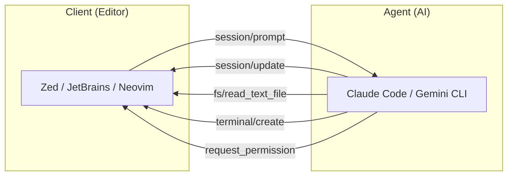
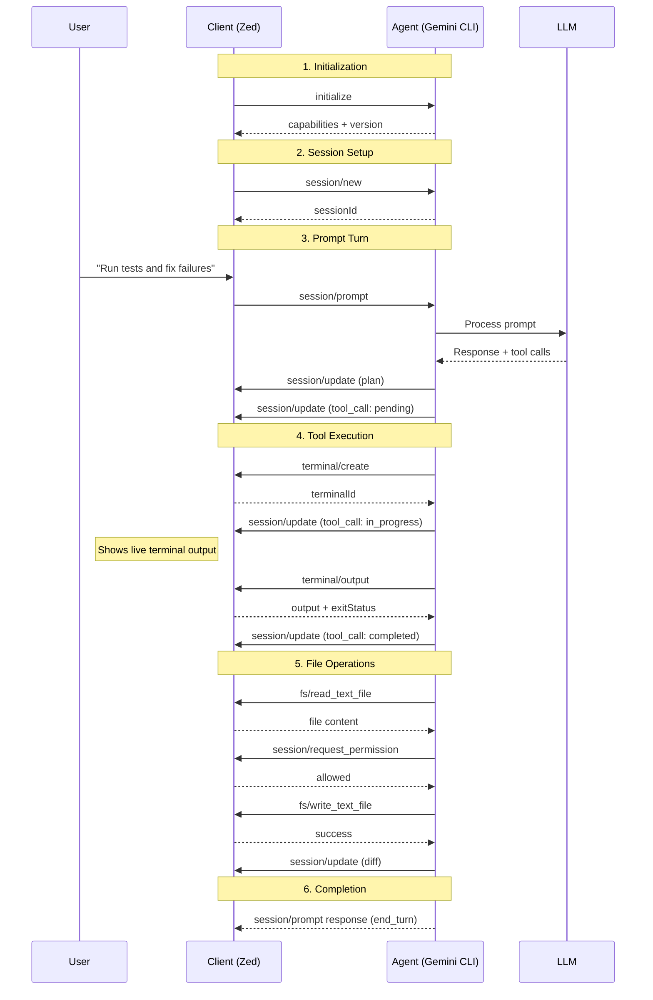
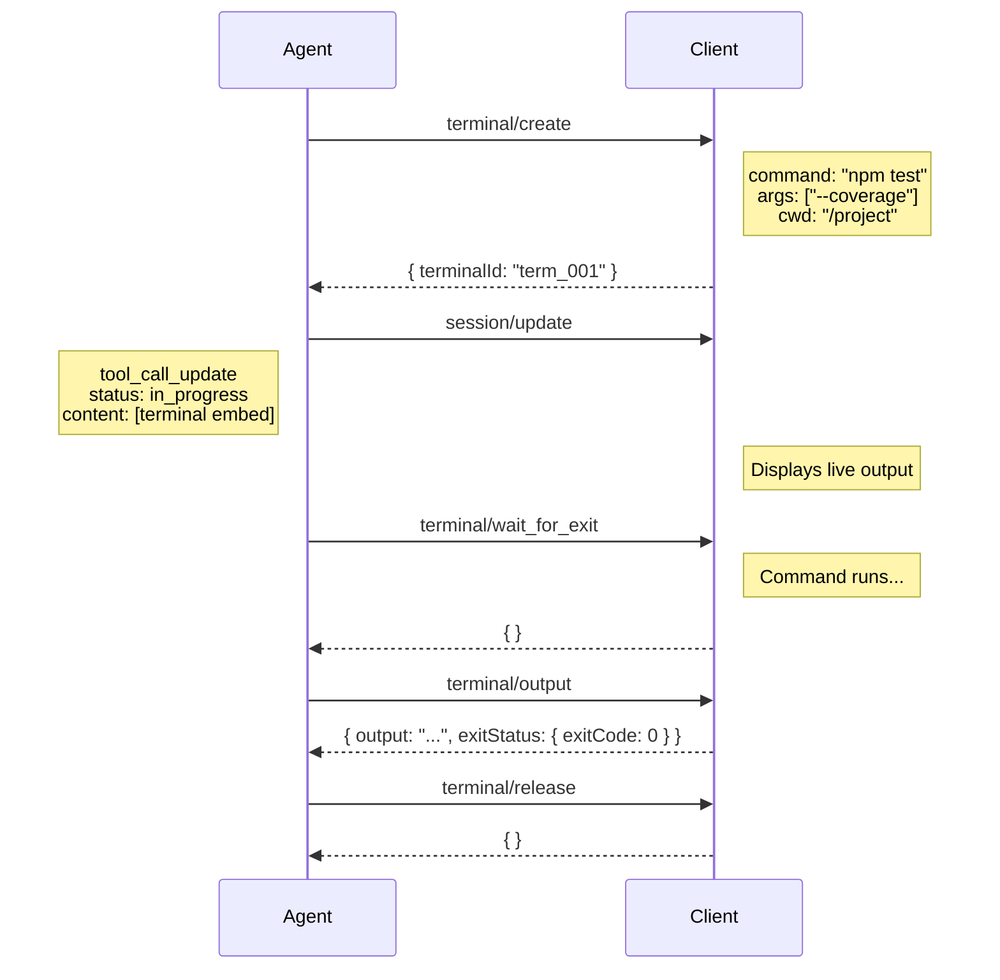
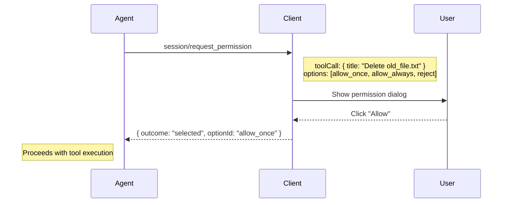

10 年前，也就是 2016 年，为了解决 VS Code 多语言支持重复开发的问题，微软团队基于 [TypeScript Server](https://github.com/Microsoft/TypeScript/tree/main/src/server) 的通信机制，开始设计通用协议，以解决编辑器与语言服务解耦。[^1] 同年的 6 月 27 日，微软在 DevNation 大会上正式宣布开源 LSP，从而解决了“针对同一语言，每个编辑器都要重写一遍智能提示”的噩梦，也标志着现代 IDE 进入了新的时代。[^2]

多年以后，同样的情况出现在了 AI Coding Agent 的领域——2025 年 8 月 27 日，Zed Industries 在博客 [Bring Your Own Agent to Zed — Featuring Gemini CLI](https://zed.dev/blog/bring-your-own-agent-to-zed) 中正式公开 ACP 协议，并推出 Zed 中整合的 Gemini CLI 作为首个 ACP 的参考实现。[^3]

<!--more-->

## 为什么需要 ACP？
截至目前，市面上已有至少 17 款成熟的 AI Coding Agent（Claude Code、Cursor、Codex CLI、Gemini CLI、Windsurf、Cline、goose、Kimi CLI、OpenCode……）。同时，至少有 6~7 款主流的编码 IDE（VS Code、IntelliJ/JetBrains、Zed、Neovim、Cursor……）。

每一个 AI Coding Agent 都需要与不同的 IDE 进行集成。如果想在 JetBrains 中使用 Claude Code？JetBrains 团队就得在 JetBrains IDE 中开发适配 Claude Code。想在 Neovim 中使用 Claude Code？不好意思，也得重新适配。

这种重复的集成工作，反反复复地出现在整个工具链生态，不仅造成了厂商锁定效应，还拖慢了创新步伐。

!!! note "厂商锁定效应"
    厂商锁定效应是指用户在选择了某款 AI Coding Agent 后，如果只有特定的 IDE 支持该 Coding Agent，则用户后续更换 Coding Agent 或者 IDE 的 **转换成本** 就会非常昂贵，导致其在未来一段时期内不得不依赖特定的 Coding Agent 或者 IDE。

    通俗地说，就是“一旦上了贼船，就很难下来”。

而 ACP 协议就是为了解决这个问题而提出，它的作用和 10 年前的 LSP 协议一样，都是为了建立一套通用标准，从而实现 AI Coding Agent 与 IDE 之间的解耦。

## ACP 的时间节点
2025 年初，Zed Industries 团队正在优化 “agentic editing” 功能，恰在此时，谷歌方面联系到他们，希望与 Zed 探讨如何在 Zed 中更深度地集成 Gemini CLI。尽管当时 Zed 已经可以在其嵌入式终端中运行 Gemini CLI 了，但通过 ANSI 转义码进行通信的方式，无法满足现代 IDE 丰富交互的需求。

正如 Zed 在博客中说的那样[^3]：“我们需要一种比 ANSI 转义码更结构化的通信方式。” 这促成了 ACP 的诞生——一个极简的 JSON-RPC 框架，它允许任意 Client 通过定义完善的 schema 与任意 Agent 进行通信。

> After shipping agentic editing earlier this year, the next big task on our roadmap was making that experience extensible. 
> 
> As luck would have it, that's around the time when Google decided to reach out. The Gemini CLI team was having a great experience using their agent in Zed's integrated terminal, and they wanted to explore what deeper integration could look like. 
> 
> Command-line agents are cool because their simplicity makes them easy to run anywhere—including as a subprocess of another application. Zed was already running Gemini CLI inside our embedded terminal emulator, but we needed a more structured way of communicating than ANSI escape codes. 
> 
> So we defined a minimal set of JSON-RPC endpoints to relay user requests to the agent and render its responses. The result is the **Agent Client Protocol**, a lean framework that lets any client talk to any agent, as long as they follow the schema.

ACP 协议于 2025 年 8 月推出，以 Gemini CLI 作为参考实现，同年 9 月便迅速集成了 Claude Code，同年 10 月又迅速集成了 Codex……

如今，ACP 是一款采用 Apache 2.0 开源许可协议的项目，背后有 Zed、谷歌、JetBrains 等行业巨头以及日益壮大的 IDE 插件开发者社区提供支持。我们可以在 ACP 协议的官网查看目前所有的 [Clients](https://agentclientprotocol.com/get-started/agents) 和 [Agents](https://agentclientprotocol.com/get-started/clients)。

## ACP 协议简介
ACP 是一种 JSON-RPC 2.0 协议，其核心原则简单明了：

- Client：各类编辑器，如 Zed、JetBrains、VS Code 等，主要负责管理用户的编程环境
- Agent：各类 AI Coding Agent，如 Claude Code、Gemini CLI、OpenClaw 等，主要负责思考与工具执行
- Client 与 Agent 之间通过标准输入输出流通信（智能体以子进程形式运行），或通过 HTTP 协议通信（远程智能体）

关于 ACP 协议的详细内容，此处不再过多介绍了，具体可以参见：[ACP 协议的官网](https://agentclientprotocol.com/get-started/introduction)。

## ACP 中的核心概念与流程
### IDE 与 Agent 的 ACP 通信

### ACP 的全生命周期图

### Terminals 命令的时序图

### 权限请求时序图

## ACP 协议的优点

### 1. 摆脱厂商绑定
还记得我们当初不得不在 Cursor、VS Code 或是特定终端代理之间艰难抉择的情况吗？有了 ACP 协议，我们完全可以根据自己的喜好选择最趁手的编辑器，再根据当前的任务需求选择最合适的代理：
- **开发复杂功能**：选用擅长架构设计和逻辑推理的代理。
- **调试疑难杂症**：切换到更擅长解析堆栈追踪和日志信息的代理。
- **编写测试用例**：选择专攻测试驱动开发的专业代理。

我们的编辑器对此毫无感知，所有的底层交互均由 ACP 协议统一处理，真正实现了工具链的自由组合。

### 2. 适配任务的最佳工具
LLM 的迭代速度极快，往往快到令人应接不暇。昨天还表现最优的模型，可能短短一周后就被新的模型所超越。如果采用专属的集成方案，我们只能被动等待编辑器厂商的支持。

而借助 ACP，我们获得了前所未有的敏捷性：
- **即插即用**：新智能体发布 → 接入 ACP → 即可在我们的编辑器中无缝使用。
- **零等待成本**：无需等待插件更新，无需更换编辑器，更无需重新适应操作习惯。

### 3. 提升团队协作的灵活性
在实际的开发团队中，我们经常会看到这样的场景：前端开发者钟爱 Claude Code，后端工程师对一款针对技术栈微调的定制化 Agent 深信不疑，而运维人员则习惯于另一套完全不同的工具。

ACP 协议能够确保无论个人偏好如何，所有人都能顺畅协作。每个人都可以使用自己得心应手的编辑器和信赖的 Agent。这同时也让团队的入职流程变得更加简便——新开发者加入时，只需告诉他们：“用你最顺手的编辑器就行，这些是我们团队在用的智能代理，它们全都兼容可用。”

### 4. 面向未来的前瞻性设计
我们正处于智能体时代的早期阶段，新功能和新范式每周都在不断涌现。未来的智能体不仅能写代码，还能够实现：
- 复杂的浏览器自动化操作
- 深度的数据库查询与分析
- 执行跨系统的复杂工作流
- 与其他智能体进行多模态协同工作

!!! note ""
    没有什么事情是不能通过抽象一层来解决的，如果有，那就再抽象一层。

## 参考文献
[^1]: [LSP History](https://github.com/microsoft/language-server-protocol/wiki/Protocol-History)
[^2]: [A Common Protocol for Languages](https://code.visualstudio.com/blogs/2016/06/27/common-language-protocol)
[^3]: [Bring Your Own Agent to Zed — Featuring Gemini CLI](https://zed.dev/blog/bring-your-own-agent-to-zed)
