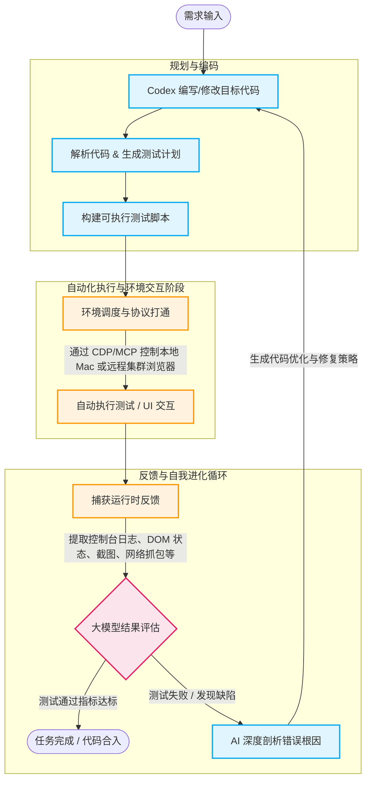
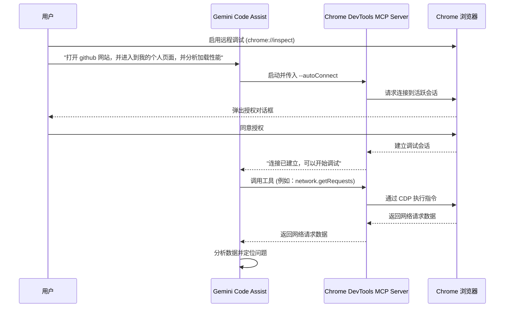

当我们用类似 Claude Code、Codex、Gemini CLI 等 AICoding Agent 写完代码，然后让它自动生成测试计划、自动调起浏览器来测试刚刚生成的代码，并根据反馈结果重新优化代码。在这个循环中，不需要人手动干预，完全依赖 AICoding Agent 自主操控，这不是一件非常美妙的事情吗？

这不就是当下爆火的 Harness Engineering 吗？正如 [Harness Engineering: Why the Best AI Engineers in 2026 Stopped Writing Code](https://x.com/heynavtoor/status/2037200578842157462) 中说的那样[^1]：

> A researcher tested the same AI model on the same coding benchmark twice. The first time, it scored 42%. The second time, it scored 78%. Same model. Same test. Same everything.

如上的框架的核心点在于：AICoding Agent 可以有效的操控浏览器。 本文将介绍三种浏览器控制方案：Playwright、Browser-use 以及伴随 Chrome M144 推出的最新利器 Chrome DevTools MCP，并通过多维度的对比，为大模型应用的架构选型提供参考。

<!--more-->

## 一个简单的例子
我们可以把如上提到的 Harness Engineering 的过程简化成如下的流程图：



当然，现实中，很多的应用并非全部都依赖浏览器来做校验。比如：iOS、Android 等的客户端的开发还需要驱动对应的模拟器或者真机来调试。但是，本文主要介绍的还是 AI Coding Agent 与浏览器的交互。

## Playwright
Playwright 原本是微软开源的现代 Web 自动化测试框架。在 Agent 爆发的早期，它成为了几乎所有 LLM 控制浏览器的底层“发动机”。大模型输出 Python 或 Node.js 代码，由 Playwright 翻译为底层的 WebSocket 指令发送给浏览器。

Playwright 的设计哲学是隔离与确定性。默认情况下，它每次启动都会拉起一个全新、无头的沙盒浏览器实例。

**Playwright 的优势：**

极高的执行速度和并发能力。由于是纯代码驱动，它在执行预定义好的大批量测试流水线时，稳定性无可匹敌。它提供了完善的 Cookie 注入、网络拦截等底层 API。

**但是，在 AI 辅助场景下，Playwright 存在致命的问题：**

* “登录墙”噩梦： 当我们希望 Agent 帮我们排查内部系统或抓取受保护的数据时，Playwright 拉起的干净实例会被瞬间挡在登录页外。面对复杂的扫码或滑块验证码，AI 几乎束手无策。
* UI 脆弱性： 一旦网页的 DOM 结构或 CSS 选择器发生微小变动，底层生成的 Playwright 代码就会直接报错崩溃，容错率极低。
* 高昂的通信延迟： 传统的 Python -> Node.js Server -> 浏览器 架构，在需要高频次拉取几万个 DOM 节点供 LLM 分析时，会产生严重的 IPC（进程间通信）延迟。

辅助场景下，Playwright 是流水线上的“无情机器”，适合确定性的 E2E 测试和后台爬虫，但不适合作为需要与人类环境共享上下文的“AI 副驾驶”。

## Browser-use
Browser-use 是目前开源社区极具代表性的高层 Agent 框架。值得注意的是，其最新版本已经进行了一次重大的底层重构：彻底抛弃了 Playwright，全面转向直接使用纯 CDP (Chrome DevTools Protocol) 与浏览器进行通信，以追求更极致的性能。

Browser-use 的核心哲学是视觉驱动。它不关心网页底层用了什么前端框架，而是直接对网页进行截图，提取出可交互元素的边界框（Bbox），并将这些带有坐标标签的图片喂给具备视觉能力的大模型（如 Claude 3.5 Sonnet）。大模型像人类一样“看”网页，然后输出诸如“点击带有购物车图标的按钮”的自然语言指令。

**Browser-use 的优势：**

极强的鲁棒性（抗干扰）： 网页改版、按钮换位置、甚至底层的 React 状态乱了都没关系，只要人眼能看懂，模型就能看懂并操作。

开发门槛极低： 开发者无需编写复杂的 DOM 选择器代码，完全通过自然语言 Prompt 驱动复杂的探索性任务。

**Browser-use 的劣势：**

Token 成本与延迟双高： 每执行一步操作，都需要向多模态大模型传输庞大的图像 Token，这在进行大规模自动化评测或高频系统调度时，成本是难以接受的。

浅层交互限制： 它只能看到网页的“表象”。如果页面由于底层跨域问题加载失败，或者 JavaScript 抛出了深层的堆栈错误，Browser-use 是无法察觉的。

Browser-use 是灵活的“AI 司机”，非常适合处理面向消费者的非结构化网页任务（如机票比价、数据探索），但在企业级深水区显得有些昂贵且不够深入。

## Chrome DevTools MCP
根据谷歌的开发者文档[^2]：

> We shipped an enhancement to the [Chrome DevTools MCP](https://github.com/ChromeDevTools/chrome-devtools-mcp) server that many of our users have been asking for: the ability for coding agents to directly connect to active browser sessions.

使用该特性，我们的 AI Coding Agent 可以实现如下的功能：

* **复用现有的 Chrome 浏览器会话**：AI Coding Agent 可以直接访问当前的浏览器会话，直接使用当前会话中的登录信息，而不需要在自动化测试的过程中增加额外的登录操作。
* **访问正在使用浏览器控制台会话**：当在 Chrome DevTools 网络面板中发现一个失败的网络请求时，可以直接选择该请求并让 AI Coding Agent 进行分析，这种 AI Coding Agent 与 人之间无缝协同的新能力让我感到非常兴奋。

如上的功能主要受益于谷歌 在 Chrome M144（beta）版本中新增的一项远程调试的功能：该功能允许 Chrome DevTools MCP 服务器接受远程调试请求。默认情况下，Chrome 会禁用远程调试连接，可以通过 `chrome://inspect#remote-debugging` 来启用该功能。

## Gemini CLI 控制 Chrome 
1.**开启远程调试**

在 Chrome 中访问 `chrome://inspect#remote-debugging` 并启用远程调试功能。


2.**安装 [Chrome DevTools MCP](https://github.com/ChromeDevTools/chrome-devtools-mcp)**

```bash
gemini mcp add -s user chrome-devtools npx chrome-devtools-mcp@latest
```

3.**修改配置文件**
打开 `~/.gemini/settings.json` 文件，修改 `chrome-devtools` 配置，在 `args` 中增加 `--autoConnect` 参数，这样 Gemini 就可以打开你当前正在使用的 Chrome 浏览器。如果不增加 `--autoConnect` 参数，Gemini 会打开一个新的 Chrome 浏览器实例。 

```json
  "mcpServers": {
    "chrome-devtools": {
      "command": "npx",
      "args": [
        "chrome-devtools-mcp@latest",
        "--autoConnect"
      ]
    }
  }
```

> 如果指定 `--autoConnect` 参数，Chrome DevTools MCP 将自动连接到由 channel 参数标识的、本地运行的 Chrome 浏览器（channel 默认为 stable）。

4.**自动连接与授权**
当 Gemini 认为需要操作 Chrome 时，Chrome DevTools MCP 会自动检测并连接到正在运行的 Chrome 实例，并弹出一个请求远程调试权限的对话框。用户授权后，Agent 便可获得当前浏览器会话的控制权。此时，浏览器会显示一个“Chrome 正由自动化测试软件控制”的横幅，以提示用户。

> 打开 github 网站，并进入到我的个人页面。


Gemini Code Assist 利用 Chrome DevTools MCP 操控 Chrome 浏览器的整体的流程如下所示：



**Chrome DevTools MCP 的优势：**

* **复用活跃会话**: 这是真正的杀手锏。当你在 Mac 上已经登录了公司内部的复杂集成系统或评测看板时，Agent 可以直接通过 MCP 连入你当前正在使用、带有完整 Cookie 和身份态的浏览器标签页。无需让 AI 去学习如何登录，实现了人类与 Agent 之间调试工作的无缝切换。

* **深达内核的数据获取**: 你的 Agent 可以直接调用底层协议，抓取 `Network` 面板的失败请求、读取 `Console` 报错日志、查看 `Elements` 面板的 DOM 树、甚至执行性能审计。这使得 AI 具备了高级前端工程师的排错能力。

* **极简且安全的架构**: 不依赖庞大的中间层，且每次连接都会有系统级的安全授权弹窗，非常契合企业对权限隔离的严格要求。

**Chrome DevTools MCP 的劣势：**

对大模型的逻辑推理和代码编写能力要求极高，因为它操作的不再是直观的 UI，而是底层的 JSON 数据和 JS 运行时。

整体看，Chrome DevTools MCP 配合 AI Coding Agent 是构建大模型自动化评测流水线、进行复杂集群环境调试的首选协议层方案。

## 参考文献
[^1]: [Harness Engineering: Why the Best AI Engineers in 2026 Stopped Writing Code](https://x.com/heynavtoor/status/2037200578842157462)
[^2]: [Let your Coding Agent debug your browser session with Chrome DevTools MCP](https://developer.chrome.com/blog/chrome-devtools-mcp-debug-your-browser-session)