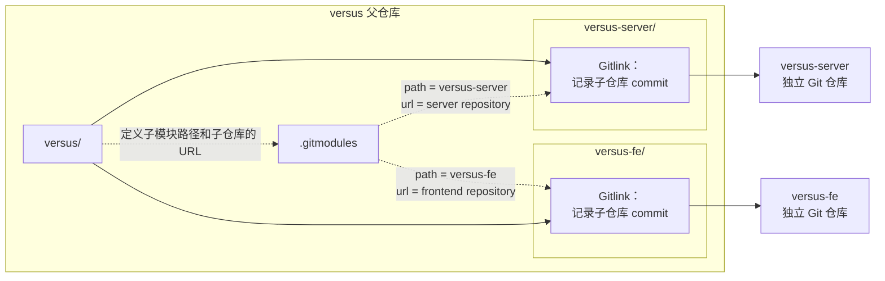
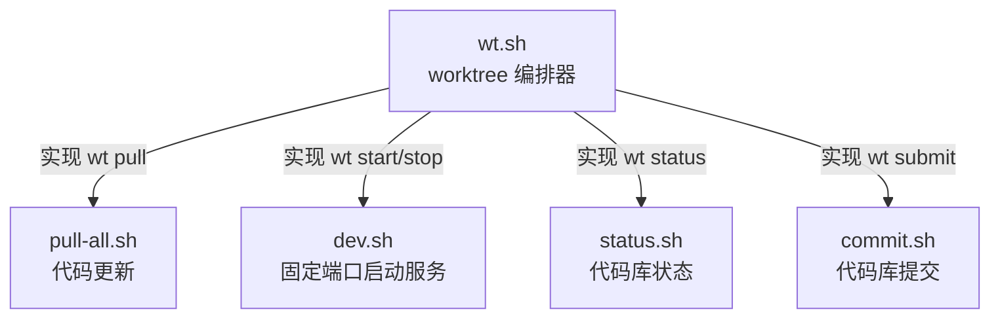
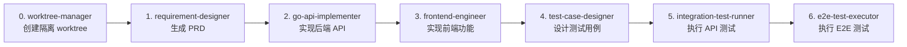
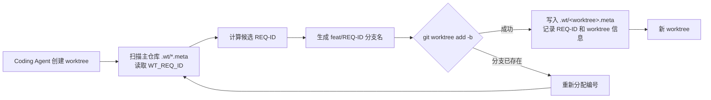

在 [是时候了解一下 Git worktree 了](/2026/06/28/It-is-time-to-learn-about-git-worktree/) 一文中，我们介绍了如何在 Codex、Claude Code 等 Coding Agent 中利用 Git worktree 实现并行开发。不过，那篇文章聚焦于单仓库场景。当我们尝试将 worktree 应用于采用多仓库架构的 LLM Arena 平台时，又遇到了一系列新问题。

本文记录我们如何为多仓库场景设计面向 Coding Agent 的 worktree 工作流，以及如何处理子模块初始化、需求编号冲突和多 Agent 编排等问题。
<!--more-->

## 1. 多仓库架构

在 [如何利用 Harness “一句话交付产品功能”？](/2026/05/28/How-to-Achieve-One-Command-Feature-Delivery-with-Harness/) 一文中，我们介绍过 [LLM Arena 平台](https://lj.baidu.com/sbs/) 的多仓库架构：使用 Git Submodule 管理多个代码仓库。



在这种架构下，仅在 `versus` 父仓库中执行 `git worktree add`，并不能得到可直接开发的完整环境。父仓库的 worktree 只会创建 `versus` 的工作目录；其中的 Submodule 仍需单独初始化，并根据父仓库记录的 Gitlink 检出对应的子仓库 commit。

假设要同时开发两个需求：

- REQ-001
- REQ-002

并希望形成如下的目录结构：

```text
.
├── versus/          # 主仓库
│     ├── versus-server/
│     └── versus-fe/
├── versus-REQ-001/  # REQ-001 的 worktree
│     ├── versus-server/
│     └── versus-fe/
└── versus-REQ-002/  # REQ-002 的 worktree
      ├── versus-server/
      └── versus-fe/
```

### 1.1 为父仓库创建 worktree

```bash
cd versus

git worktree add \
  -b req-001 \
  ../REQ-001 \
  origin/master

git worktree add \
  -b req-002 \
  ../REQ-002 \
  origin/master
```

此时，每个父仓库的 worktree：

- 有独立工作目录
- 有独立索引和当前分支
- 共享父仓库的 Git 对象库
- 可以由不同的 Coding Agent 并行操作
- **但此时子模块目录可能还是空的，或者尚未初始化**


### 1.2 在 worktree 中初始化子模块

```bash
cd ../REQ-001

git submodule sync --recursive
git submodule update --init --recursive
```

上述命令可以完成子模块初始化，但每次手动执行都很烦琐。如果让 Coding Agent 临时推理并生成操作步骤，不仅会消耗额外的 token，还容易因上下文差异产生不稳定行为。因此，我们编写了 `wt.sh`，将 worktree 创建、子模块初始化、端口分配和环境配置固化为确定性流程。

!!! warning "Git Submodule 的限制"
    Git 官方文档指出，多 worktree 场景下的 Submodule 支持仍不完整，并不推荐对 superproject 进行多重检出。因此，这套方案需要结合实际使用的 Git 版本、子模块结构和更新方式进行验证，不能直接视为通用方案。详见 [git-worktree 官方文档](https://git-scm.com/docs/git-worktree#_bugs)。

```bash
# wt.sh - Versus 多需求并行开发 worktree 管理脚本
#
# 设计目标:
#   - 每个需求一个独立 Git worktree，代码任务真正并行、互不干扰
#   - 每个 worktree 分配独立端口（后端 9000+N / 前端 4000+N），接口测试可并行
#   - 数据库共享 dev，不隔离；E2E 手动 / 顺序执行
#   - 不改入库业务代码：端口与代理只在 worktree 内本地改 + assume-unchanged
#   - 代码提交复用 scripts/commit.sh（百度 iCode Gerrit 评审流程）
#
# 用法:
#   ./scripts/wt.sh new <id>                         # 创建 worktree（id 如 req-030 / REQ-030 / 030）
#   ./scripts/wt.sh list                             # 列出所有 worktree + 端口 + 状态
#   ./scripts/wt.sh go <id>                          # 切换到 worktree（需 shell-init 的 function）
#   ./scripts/wt.sh remove <id> [--keep-branch]      # 删除 worktree（默认连带本地分支）
#   ./scripts/wt.sh info <id>                        # 查看单个 worktree 详情
#   ./scripts/wt.sh current                          # 查看当前目录属于哪个 worktree
```



## 2. 构建 worktree-manager Agent

在 [如何利用 Harness “一句话交付产品功能”？](/2026/05/28/How-to-Achieve-One-Command-Feature-Delivery-with-Harness/) 的“4.2 Harness 闭环设计”一节中，我们使用 6 个 Sub-Agent 实现需求开发闭环。


现在，我们还需要把 worktree 管理能力加入整个 Harness 闭环。为此，我们新增了 `worktree-manager` Agent。

每个需求都有一个贯穿开发流程的唯一 `REQ-ID`。引入 `worktree-manager` 后，`REQ-ID` 的生成也需要从需求设计阶段前移到 worktree 创建阶段。

### 2.1 定义 worktree-manager

``````bash
---
name: "worktree-manager"
description: "Use this agent when a new requirement or modification task needs to be started and a dedicated worktree should be created for isolated development. This agent should be triggered BEFORE the requirement-designer agent in the collaboration pipeline, ensuring that each requirement gets its own isolated Git Worktree with independent ports and runtime environment. This is essential for parallel development of multiple requirements without code or port conflicts."
---

## Operational Procedures
### Step 1: Check Existing Worktrees
Before creating anything, check if a worktree already exists for the given requirement:

```bash
# Check current worktree status（在项目根目录执行）
bash scripts/wt.sh list
```

Also verify with git:
```bash
git worktree list
```
......
``````

如上所示，`worktree-manager` 本质上是对 `wt.sh` 的 Agent 化封装：Agent 负责理解意图和编排步骤，脚本负责执行确定性的底层操作。

### 2.2 调整 Sub-Agent 编排流程

在原有流程前增加 `worktree-manager`，具体编排如下：




接下来，我们开启两个 Session，通过不同的 worktree 并行开发两个需求。


## 3. REQ-ID 冲突

当我们真正利用 worktree 并行开发多个需求时，新问题出现了：两个 Session 分别进入不同的 worktree，却生成了相同的 `REQ-ID`。

当 `docs/requirements/` 中最新的需求目录为 `REQ-30` 时，两个 Coding Agent 都读取到相同状态，并将下一个编号计算为 `REQ-31`。


单独看每个需求，两者都能继续开发；但当代码合并回 `versus` 父仓库时，相同的需求目录和文件路径必然产生冲突。

**很多实践看起来简单，真正落地时却会暴露一连串问题，而解决这些问题正是创新的一部分。**

这是一个典型的并发竞争：多个进程读取相同状态，各自计算出相同的下一个编号，然后尝试写入结果。它与数据库中的“丢失更新”问题具有相似结构。


我们的解决思路是复用 Git 已有的互斥保护，而不是另外实现一套锁：

- 所有 worktree 共享同一个 Git 引用空间。
- `git worktree add -b <branch>` 会创建新分支；如果该分支已经存在，命令默认失败。
- Git 也默认禁止同一个本地分支同时被多个 worktree 检出。

因此，我们让 `REQ-ID` 同时参与分支命名，把创建 `feat/<REQ-ID>` 分支作为编号预占操作。即使两个进程计算出相同的 `REQ-ID`，也只有一个能成功创建对应分支；失败的一方重新扫描并分配新编号。

同时，`wt.sh` 会在主仓库的 `.wt` 目录中记录已分配的 `REQ-ID`。后续分配先扫描这些元数据，再尝试通过 Git 创建分支完成最终确认。

```bash
ROOT_DIR="$(cd "$(dirname "$0")/.." && pwd)"
WT_ROOT="${WT_ROOT:-$ROOT_DIR/..}"  # worktree 存放根目录，默认为主仓库父目录
WT_META_DIR="$ROOT_DIR/.wt"         # 注册表目录（.gitignore 已忽略）

write_meta() {
    local id=$1 path=$2 branch=$3 be=$4 fe=$5 req_id=${6:-}
    echo "WT_REQ_ID=$req_id" > "$WT_META_DIR/$id.meta"
}
```

创建 worktree 时，脚本使用 `feat/$id` 作为分支名。若同名分支已经存在，`-b` 会拒绝覆盖，脚本便终止本次创建。上层 Agent 识别出同名分支冲突后，再重新分配编号并重试；其他错误则直接上报，避免无意义重试。

```bash
id=$(allocate_req_id)

info "[1/6] 创建 Git Worktree（基于 master）..."
if ! git -C "$ROOT_DIR" worktree add -b "feat/$id" "$wt_path" master 2>&1; then
    error "创建 worktree 失败"
    exit 1
fi
```

整体流程如下所示：



下面，我们启动两个 Coding Agent 会话，并行执行两个需求。从实际结果看，两个 Agent 分别获得 `REQ-42` 和 `REQ-43`，并成功创建了对应的 worktree 与需求分支。


!!! warning "注意"
    这套互斥机制依赖同一份本地 Git 引用空间，只能解决同一台机器、同一个父仓库中的并发分配问题。多名工程师在不同机器上并行开发时，本地分支无法形成全局互斥，仍可能生成相同的 `REQ-ID`。

    当前场景的目标是在一台开发机器上并行运行多个 Agent，因此该方案已经满足需求。如果未来需要跨机器分配编号，应改用中心化服务、数据库唯一约束或远程原子引用等全局协调机制。

## 4. 多 worktree 并行开发

LLM Arena 平台已经能够满足基本评测需求，但仍有一些交互体验问题需要优化，例如：

- 分类管理页面缺少分页；创建分类时，父分类 ID 仍需手动填写，操作不够友好。
- 模型效果页面滑动到底部后，媒体资源卡片可能无法对齐，页面会出现大块空白。


过去，我们使用 Harness Engineering 串行处理这些需求。将其升级为 worktree 模式后，不同需求可以在相互隔离的环境中并行推进。


当 Coding Agent 能够在不同且相互隔离的 worktree 中并行开发时，多个独立需求不必再排队等待，整体开发吞吐量得到显著提升。


## 5. `/teamwork-preview` 编排

最初，7 个 Sub-Agent 的编排规则都定义在 `versus/CLAUDE.md` 中。

``````bash
## 自动化工作流

### 流水线概览

```
用户: "开启 7 个 Agent 协作实现 XXX 需求"
│
▼
[0] worktree-manager       →  创建隔离 worktree + 分配端口
│
▼ status=completed（主会话 EnterWorktree(path=...) 切换）
[1] requirement-designer   →  产出 PRD.md + 分配需求 ID
│
▼ status=awaiting_review
⏸ 人工审核 PRD（用户确认后继续）
│
▼ 用户确认 → status=completed
[2] go-api-implementer     →  产出 Go 代码 + api-summary.md
│
▼ status=completed（自动流转）
[3] frontend-engineer      →  产出 React 代码
│
▼ status=completed（自动流转）
[4] test-case-designer     →  产出 api-test-cases.json + e2e-test-cases.json
│
▼ status=completed（自动流转，串行启动）
[5] integration-test-runner (worktree端口)  →  [6] e2e-test-executor (worktree端口+1)
│                                           │
▼                                           ▼
status=has_bugs → Bug修复循环               status=all_passed → 流水线完成
```
``````

每次启动流程时，我们都要重复输入相同的指令：

> 开启 7 个 Agent 协作，实现：……

这条指令虽然不长，但仍暴露出一个问题：工作流依赖用户记住并重复输入约定，而不是由系统提供稳定入口。恰好，7 月 14 日，Google Antigravity 发布了 Agent Teams 的演示：运行 `/teamwork-preview`，即可启动一个由专业 Sub-Agent 组成的动态团队，在后台协调、规划、构建并验证复杂任务。



受此启发，我们也实现了 `/teamwork-preview`，用一条稳定指令启动完整协作流程：

> /teamwork-preview ……

在 Claude Code 中，可以通过 Skill 封装这类工作流。于是，我们把 `CLAUDE.md` 中的 Sub-Agent 编排规则迁移到 `teamwork-preview` Skill，将触发方式、执行顺序、状态流转和异常恢复集中管理。


因此，`/teamwork-preview` 本质上是一个基于 Skill 编排 Sub-Agent 的工作流：

- 使用 Skill 组织领域知识和操作流程，降低重复上下文的成本。
- 使用外部状态文件记录执行进度，增强主 Agent 的任务恢复能力。
- 使用管理类 Skill 编排工作流，使用能力类 Skill 增强各个 Sub-Agent。


## 6. 总结

Coding Agent 提升了代码生成和任务执行的速度，却不会让并发竞争、状态一致性和资源隔离等经典工程问题自动消失。Agent 越多、并行度越高，这些问题反而越容易暴露。

这次实践最终沉淀出三个原则：

- **将推理与执行分离。** Agent 负责理解需求和编排流程，脚本负责执行可重复、可验证的底层操作。
- **优先复用已有约束。** 使用 Git 分支创建的失败保护完成本地互斥，比另行维护一套脆弱的锁机制更简单。
- **明确方案边界。** 本地 Git 引用只能协调单机并发；跨机器场景需要真正的全局协调机制。

AI 可以替我们完成更多操作，但不能替我们理解系统。恰恰因为开发速度更快、并行规模更大，我们更需要掌握底层原理，并用清晰的架构约束 Agent 的行为。
