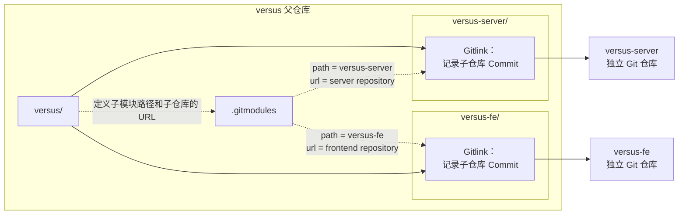
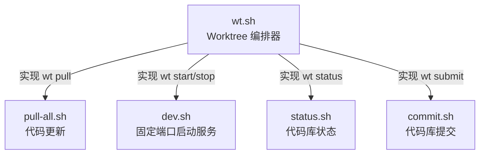
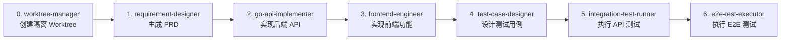

在 [是时候了解一下 git worktree 了](/2026/06/28/It-is-time-to-learn-about-git-worktree/) 这篇文章中，我们介绍了如何在 Codex 或者 Claude Code 这样的 Coding Agent 中使用 Git Worktree 来实现并行开发。但是，这篇文章的核心聚焦于单仓库场景的 Worktree，当我们尝试把 Worktree 应用到基于多仓库的 LLM Arena 平台时，我们却遇到了各种问题。

这篇文章着重介绍我们在多仓库场景下实现面向 Coding Agent 的 Git Worktree。
<!--more-->

## 1. Multi-Repo 架构
在 [如何利用 Harness “一句话交付产品功能”？](/2026/05/28/How-to-Achieve-One-Command-Feature-Delivery-with-Harness/) 中已经介绍过 [LLM Arena 平台](https://lj.baidu.com/sbs/) 的多仓库架构：通过 Git Submodule 管理多个代码仓库。



在这种多仓库的架构下，想要采用 worktree 实现并行开发，仅仅在 `versus` 父仓库上执行 `git worktree add` 是远远不够的。`versus`父仓库的 worktree 只负责创建 versus 的工作目录，而每个新 worktree 中的 Submodule 还需要单独初始化，并根据父仓库记录的 Gitlink，把子仓库检出到对应 Commit。

建设要同时开发两个需求：
- REQ-001
- REQ-002

并希望形成如下的目录结构：

```text
.
├── versus/ # 主仓库
│     ├── versus-server/
│     └── versus-fe/
├── versus-REQ-001/  # worktree for REQ-001
│     ├── versus-server/
│     └── versus-fe/
└── versus-REQ-002/  # worktree for REQ-002
      ├── versus-server/
      └── versus-fe/
```

### 1.1 为父仓库创建 Worktree

```bash
cd versus

git worktree add \
  ../REQ-001 \
  -b req-001 \
  origin/master

git worktree add \
  ../REQ-002 \
  -b req-002 \
  origin/master
```

此时，每个父仓库的 Worktree：
- 有独立工作目录
- 有独立索引和当前分支
- 共享父仓库的 Git 对象库
- 可以由不同 Coding Agent 并行操作
- **但此时子模块目录可能还是空的，或者尚未初始化**


### 1.2 在 Worktree 中初始化子模块

```bash
cd ../REQ-001

git submodule sync --recursive
git submodule update --init --recursive
```

可以使用如上的命令初始化子模块，但是每次都执行这样的操作太麻烦了。更重要的是，如果让 Coding Agent 来实时推理并生成对应的操作步骤：一方面太浪费 token，另一方面还容易带来不稳定性。因此，我们构建了 `wt.sh` 脚本来自动化这个过程。

```bash
# wt.sh - Versus 多需求并行开发 Worktree 管理脚本
#
# 设计目标:
#   - 每个需求一个独立 Git Worktree，代码任务真正并行、互不干扰
#   - 每个 worktree 分配独立端口（后端 9000+N / 前端 4000+N），【接口测试可并行】
#   - 数据库共享 dev，不隔离；E2E 手动 / 顺序执行
#   - 不改入库业务代码：端口与代理只在 worktree 内本地改 + assume-unchanged
#   - 代码提交复用 scripts/commit.sh（百度 iCode Gerrit 评审流程）
#
# 用法:
#   ./scripts/wt.sh new <id>                         # 创建 worktree（id 如 req-030 / REQ-030 / 030）
#   ./scripts/wt.sh list                             # 列出所有 worktree + 端口 + 状态
#   ./scripts/wt.sh go <id>                          # 切换到 worktree（需 shell-init 的 function）
#   ./scripts/wt.sh remove <id> [--keep-branch]      # 删除 worktree（默认连带本地分支）
#   ./scripts/wt.sh info <id>                        # 查看单个 worktree 详情
#   ./scripts/wt.sh current                          # 查看当前目录属于哪个 worktree
```



## 2.构建 Worktree Sub-Agent
在 [如何利用 Harness “一句话交付产品功能”？](/2026/05/28/How-to-Achieve-One-Command-Feature-Delivery-with-Harness/) 中的 *4.2 Harness 闭环设计* 中，我们采用 6 个 Sub-Agents 实现需求开发闭环。


而现在，我们需要把 Worktree 管理的能力也加入到整个 Harness 闭环流程中。为此，我们需要新增一个 worktree-manager 子 Agent。

另外，在需求设计阶段，每个需求都有一个唯一的 `REQ-ID`，该 `REQ-ID` 贯穿整个的开发流程。增加 worktree-manager sub-agent 之后，需要把 `REQ-ID` 的生成提前到 worktree-manager sub-agent 阶段。

### 2.1 worktree-manager Agent
``````bash
---
name: "worktree-manager"
description: "Use this agent when a new requirement or modification task needs to be started and a dedicated worktree should be created for isolated development. This agent should be triggered BEFORE the requirement-designer agent in the collaboration pipeline, ensuring that each requirement gets its own isolated Git Worktree with independent ports and runtime environment. This is essential for parallel development of multiple requirements without code or port conflicts."
---

## Operational Procedures
### Step 1: Check Existing Worktrees
Before creating anything, check if a worktree already exists for the given requirement:

```bash
# Check current worktree status（在项目根目录执行）
bash scripts/wt.sh list
```

Also verify with git:
```bash
git worktree list
```
......
``````

如上所示，worktree-manager 子 Agent 实际上是对 `wt.sh` 脚本的封装。

### 2.2 修改 Sub-Agents 的编排流
在原有的 Sub-Agents 编排流基础上，增加 worktree-manager 子 Agent 的调用，具体流程如下所示。




接下来，我们开启两个 Session，通过 Worktree 并行开发 2 个需求。


