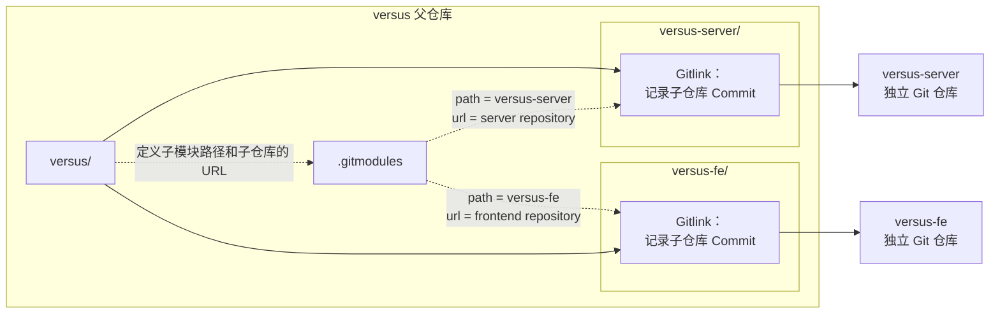
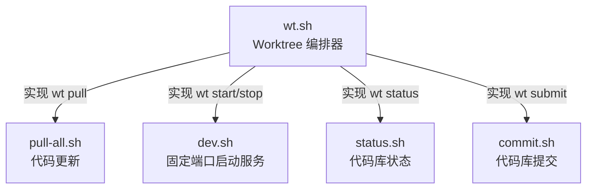
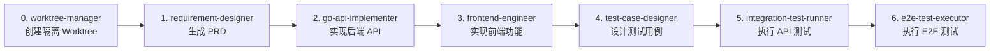
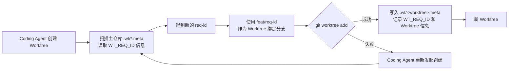

在 [是时候了解一下 git worktree 了](/2026/06/28/It-is-time-to-learn-about-git-worktree/) 这篇文章中，我们介绍了如何在 Codex 或者 Claude Code 这样的 Coding Agent 中使用 Git Worktree 来实现并行开发。但是，这篇文章的核心聚焦于单仓库场景的 Worktree，当我们尝试把 Worktree 应用到基于多仓库的 LLM Arena 平台时，我们却遇到了各种问题。

这篇文章着重介绍我们在多仓库场景下实现面向 Coding Agent 的 Git Worktree。
<!--more-->

## 1. Multi-Repo 架构
在 [如何利用 Harness “一句话交付产品功能”？](/2026/05/28/How-to-Achieve-One-Command-Feature-Delivery-with-Harness/) 中已经介绍过 [LLM Arena 平台](https://lj.baidu.com/sbs/) 的多仓库架构：通过 Git Submodule 管理多个代码仓库。



在这种多仓库的架构下，想要采用 worktree 实现并行开发，仅仅在 `versus` 父仓库上执行 `git worktree add` 是远远不够的。`versus`父仓库的 worktree 只负责创建 versus 的工作目录，而每个新 worktree 中的 Submodule 还需要单独初始化，并根据父仓库记录的 Gitlink，把子仓库检出到对应 Commit。

建设要同时开发两个需求：
- REQ-001
- REQ-002

并希望形成如下的目录结构：

```text
.
├── versus/ # 主仓库
│     ├── versus-server/
│     └── versus-fe/
├── versus-REQ-001/  # worktree for REQ-001
│     ├── versus-server/
│     └── versus-fe/
└── versus-REQ-002/  # worktree for REQ-002
      ├── versus-server/
      └── versus-fe/
```

### 1.1 为父仓库创建 Worktree

```bash
cd versus

git worktree add \
  ../REQ-001 \
  -b req-001 \
  origin/master

git worktree add \
  ../REQ-002 \
  -b req-002 \
  origin/master
```

此时，每个父仓库的 Worktree：
- 有独立工作目录
- 有独立索引和当前分支
- 共享父仓库的 Git 对象库
- 可以由不同 Coding Agent 并行操作
- **但此时子模块目录可能还是空的，或者尚未初始化**


### 1.2 在 Worktree 中初始化子模块

```bash
cd ../REQ-001

git submodule sync --recursive
git submodule update --init --recursive
```

可以使用如上的命令初始化子模块，但是每次都执行这样的操作太麻烦了。更重要的是，如果让 Coding Agent 来实时推理并生成对应的操作步骤：一方面太浪费 token，另一方面还容易带来不稳定性。因此，我们构建了 `wt.sh` 脚本来自动化这个过程。

```bash
# wt.sh - Versus 多需求并行开发 Worktree 管理脚本
#
# 设计目标:
#   - 每个需求一个独立 Git Worktree，代码任务真正并行、互不干扰
#   - 每个 worktree 分配独立端口（后端 9000+N / 前端 4000+N），【接口测试可并行】
#   - 数据库共享 dev，不隔离；E2E 手动 / 顺序执行
#   - 不改入库业务代码：端口与代理只在 worktree 内本地改 + assume-unchanged
#   - 代码提交复用 scripts/commit.sh（百度 iCode Gerrit 评审流程）
#
# 用法:
#   ./scripts/wt.sh new <id>                         # 创建 worktree（id 如 req-030 / REQ-030 / 030）
#   ./scripts/wt.sh list                             # 列出所有 worktree + 端口 + 状态
#   ./scripts/wt.sh go <id>                          # 切换到 worktree（需 shell-init 的 function）
#   ./scripts/wt.sh remove <id> [--keep-branch]      # 删除 worktree（默认连带本地分支）
#   ./scripts/wt.sh info <id>                        # 查看单个 worktree 详情
#   ./scripts/wt.sh current                          # 查看当前目录属于哪个 worktree
```



## 2.构建 Worktree Sub-Agent
在 [如何利用 Harness “一句话交付产品功能”？](/2026/05/28/How-to-Achieve-One-Command-Feature-Delivery-with-Harness/) 中的 *4.2 Harness 闭环设计* 中，我们采用 6 个 Sub-Agents 实现需求开发闭环。


而现在，我们需要把 Worktree 管理的能力也加入到整个 Harness 闭环流程中。为此，我们需要新增一个 worktree-manager 子 Agent。

另外，在需求设计阶段，每个需求都有一个唯一的 `REQ-ID`，该 `REQ-ID` 贯穿整个的开发流程。增加 worktree-manager sub-agent 之后，需要把 `REQ-ID` 的生成提前到 worktree-manager sub-agent 阶段。

### 2.1 worktree-manager Agent
``````bash
---
name: "worktree-manager"
description: "Use this agent when a new requirement or modification task needs to be started and a dedicated worktree should be created for isolated development. This agent should be triggered BEFORE the requirement-designer agent in the collaboration pipeline, ensuring that each requirement gets its own isolated Git Worktree with independent ports and runtime environment. This is essential for parallel development of multiple requirements without code or port conflicts."
---

## Operational Procedures
### Step 1: Check Existing Worktrees
Before creating anything, check if a worktree already exists for the given requirement:

```bash
# Check current worktree status（在项目根目录执行）
bash scripts/wt.sh list
```

Also verify with git:
```bash
git worktree list
```
......
``````

如上所示，worktree-manager 子 Agent 实际上是对 `wt.sh` 脚本的封装。

### 2.2 修改 Sub-Agents 的编排流
在原有的 Sub-Agents 编排流基础上，增加 worktree-manager 子 Agent 的调用，具体流程如下所示。




接下来，我们开启两个 Session，通过 Worktree 并行开发 2 个需求。


## 3. REQ-ID 冲突
正当我们要利用 worktree 让 Coding Agent 并行开发多个需求的时候，我们发现我们高兴的太早了。我们启动了 2 个 Session，每个 Session 都在不同的 Worktree 中开发不同的需求。但是，我们发现这个两个 worktree 中生成的 REQ-ID 是同一个。

当 `docs/requirements/` 目录下的最新需求目录为 `REQ-30` 时，两个 Coding Agent 生成的 REQ-ID 都是 `REQ-31`。


从需求实现上来看，这也没有什么问题。最大的问题在于：如果 `REQ-ID` 一致，那么父仓库 `versus` 代码合并时就会存在不可避免的代码冲突。哎呀，想想都头疼。

**很多实践就是这样，看着很简单，但是真正上手，却发现有解不完的问题。但是，这不就是创新的过程吗？**

这是一个典型的分布式架构下，多进程并行处理相同的数据时存在的 **“丢失更新”** 的问题。


经过调研，我们希望采用 Git Worktree 的“并行”特性来解决这个问题：
* Git 不允许同一个本地分支同时被多个 worktree checkout。如果目标 branch 已经在另一个 worktree 中被 checkout，那么 git worktree add 会拒绝创建一个新的 worktree。

于是我们优化了 `wt.sh` 脚本，每创建一个 worktree 时，就在主仓库的 `.wt` 目录下，写入 `REQ-ID` 信息。在分配 `REQ-ID` 时，统一从 `.wt` 目录下读取已分配的 `REQ-ID`，避免并发冲突。

```bash
ROOT_DIR="$(cd "$(dirname "$0")/.." && pwd)"
WT_ROOT="${WT_ROOT:-$ROOT_DIR/..}"  # worktree 存放根目录，默认主仓库父目
WT_META_DIR="$ROOT_DIR/.wt"         # 注册表目录（.gitignore 已忽略）

write_meta() {
    local id=$1 path=$2 branch=$3 be=$4 fe=$5 req_id=${6:-}
    echo "WT_REQ_ID=$req_id" > "$WT_META_DIR/$id.meta"
}
```

同时，采用 `feat/req-id` 作为分支名，如果 `feat/req-id` 已经被 checkout，那么 worktree 的创建就会失败。然后 Coding Agent 就会重新创建 worktree，从而消除并发带来的 `REQ-ID` 一致的问题。 

```bash
req_id=$(allocate_req_id)
 
info "[1/6] 创建 Git Worktree（基于 master）..."
if ! git -C "$ROOT_DIR" worktree add "$wt_path" -b "feat/$id" master 2>&1; then
    error "创建 worktree 失败"
    exit 1
fi
```

整体流程如下所示：



下面我们启动 2 个 Coding Agent Sessions 并并行执行 2 个需求开发任务。从实际的运行结果看，两个 Coding Agent 分别创建了 REQ-42、REQ-43 两个 Worktree，并且成功地将它们绑定到了对应的需求分支上。


!!! warning "注意"
    实际上，如上的方案在多人并行开发时依然存在 `REQ-ID` 冲突的问题。但是，当我们已经实现同一台开发机器上并行 *N* 个开发任务时，我们是否还有必要采用 *N* 个工程师来并行开发需求？
    
    我认为，当前的方案虽然不完美，但是已经解决了我们所面临的问题。没必要采用更加复杂的方案来解决可能不会发生的问题。


## 4. 多 Worktree 并行开发
目前，虽然 LLM Arena 平台可以满足我们的评测需求，但是仍然有许多交互体验问题需要优化，例如：
- 分类管理页面没有设置分页；并且创建新分类时，父分类 ID 需要手动填写，整体的交互体验并不是特别优化。
- 模型效果页面存在当页面滑动到最底部时，会出现媒体资源卡片显示不对齐的问题，存在较大的空白区域，整体页面视觉不美观。


以前，我们会采用 Harness Engineering 串行优化这些需求。当我们把 Harness Engineering 升级到 worktree 模式后，我们就可以并行开发这些需求了。


当 Coding Agent 可以在不同的、相互隔离的 worktree 中并行开发不同的需求时，开发吞吐量瞬间翻倍，真是飞一般的感觉。


## 5. teamwork-preview 编排
截止到现在，我们对于 7 个 Sub-Agents 的编排规则位于 `versus/CLAUDE.md` 中。

``````bash
## 自动化工作流

### 流水线概览

```
用户: "开启7个Agent协作实现XXX需求"
│
▼
[0] worktree-manager       →  创建隔离 Worktree + 分配端口
│
▼ status=completed（主会话 EnterWorktree(path=...) 切换）
[1] requirement-designer   →  产出 PRD.md + 分配需求 ID
│
▼ status=awaiting_review
⏸ 人工审核 PRD（用户确认后继续）
│
▼ 用户确认 → status=completed
[2] go-api-implementer     →  产出 Go 代码 + api-summary.md
│
▼ status=completed（自动流转）
[3] frontend-engineer      →  产出 React 代码
│
▼ status=completed（自动流转）
[4] test-case-designer     →  产出 api-test-cases.json + e2e-test-cases.json
│
▼ status=completed（自动流转，串行启动）
[5] integration-test-runner (worktree端口)  →  [6] e2e-test-executor (worktree端口+1)
│                                           │
▼                                           ▼
status=has_bugs → Bug修复循环               status=all_passed → 流水线完成
```
``````

因此，每次我们都要重复输入相同的提示词指令：
> 开启 7 个 Agent 协作，实现：……

虽然还不到 10 个词，但是再也不想重复输入了。恰好，7 月 14 日，谷歌发推文宣传 Antigravity 中新特性 Agent Teams。只需要运行 `/teamwork-preview`，就可启动一个由专业子代理组成的动态团队，他们在后台协调、规划、构建和验证复杂的工程任务。



受此启发，我决定也实现一个类似的 `/teamwork-preview` 指令，这样就可以通过一条指令启动整个协作流程，而无需重复输入提示词。
> /teamwork-preview ……

在 Claude Code 中，可以通过创建对应的 Skills 来实现类似的功能。于是，我们把 CLAUDE.md 中对 Sub-Agents 的定义迁移到 `teamwork-preview` Skill 中，从而实现了类似谷歌的 `/teamwork-preview` 的效果。


因此，`/teamwork-preview` 是一个基于 skills 编排 sub-agents 的工作流：
- 通过 skills 优化知识编排和索引效率；
- 通过外挂的状态文件增强 主 agent 的任务恢复能力；
- 通过 管理类 skill 实现工作流编排，通过 技能类 skills 增强 sub-agents 的能力；


## 6. 总结
类似分布式、多进程并发问题在 AI 时代下也依然存在。采用什么架构来更优美的编排我们的 Agents、Skills 仍然属于架构范畴，任然需要一定的架构约束。

我们总认为，AI 可以帮我们做非常多的事情；有了 AI，我们就可以不用向之前那样去刻苦学习哪些底层的原理、架构知识……

因此，恰恰相反，AI 时代下，我们需要更认真的去学习、了解底层原理、架构知识。
