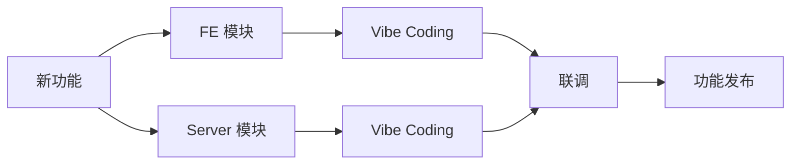
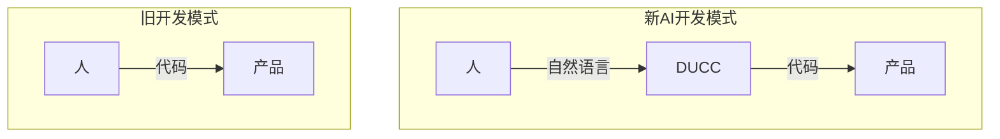
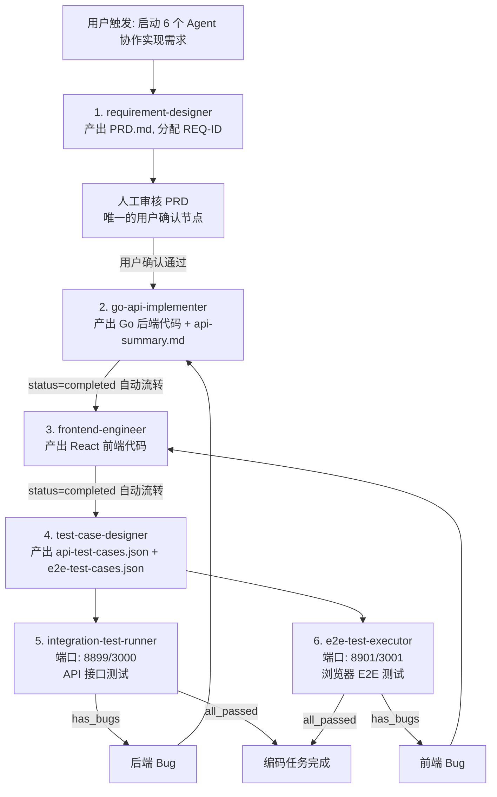
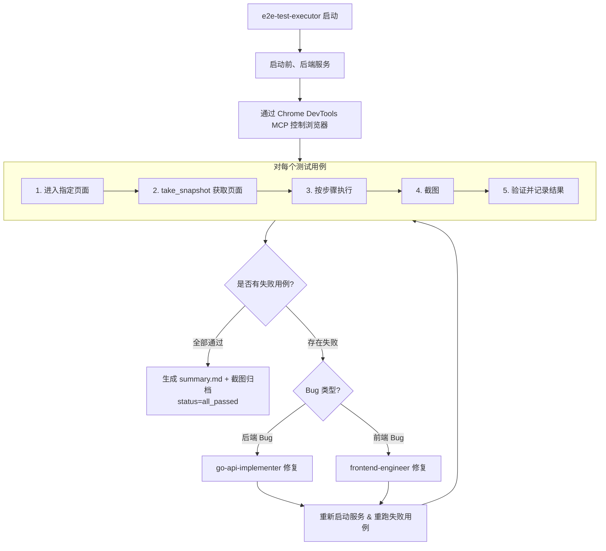

为了更快的发布 [大模型评测平台](https://lj.baidu.com/sbs/)，我们借鉴 `OpenAI` 的思路搭建了一套 `Harness` 模式，之前需要 1 天开发完的功能，现在基本上 2 个小时左右就可以完成。


<!--more-->

## 1. 背景

在 [我让 OpenClaw 🦞 管理大模型评测任务](/2026/03/15/I-use-OpenClaw-to-manage-LLMs-evals-tasks/) 中提到，我们通过自建的 `Side-by-Side` 平台来实现多模态大模型的偏好打分以及对抗榜单结果。在 2026 年 2 月平台刚上线的时候，还只支持最基本的 `Side-by-Side` 的功能，比如只支持生图大模型的评测，并且对于图生图大模型而言，仅支持参考图片为单图的评估场景……因此，我们的评测平台属于是一个功能不断丰富、扩展的状态。平台功能的升级一方面来自参与到实际评估中的用户的真实反馈，另一方面来自我们对平台功能点的规划。


在实现上，平台由 `React` 的前端服务 `versus-fe` 和 `Go` 的后端服务 `versus-server` 构成，并且对于前后端的这 2 个服务，我们分别安排了一个同学来负责。整体看，这个系统也属于：麻雀虽小、五脏俱全。

## 2. Vibe Coding

!!! note ""
    `Vibe Coding` 是“AI 代写代码，人来统筹状态”；而 `Harness` 是“代码库即唯一事实，`Agent` 自治流转状态”。

最开始的时候，我们的前后端开发人员各自使用 `DUCC` 通过 `Vibe Coding` 的方式来编码前后端服务，然后再进行联调测试，最后再利用我们内部的上线平台发布新功能。



可以看到，`Vibe Coding` 模式下，开发过程中的唯一的变化就是代码的实现由人变成了 AI。而新功能的拆解，模块之间的联调，代码的迭代调整还都是人来驱动的，不同的是，人的产物不再是代码，而是自然语言。我们最开始并不太懂 `React`，但是整个平台在 AI 的帮助下，也就这么构建起来了。无疑，`Vibe Coding` 极大地降低了产品开发的门槛。



慢慢地，我们发现，虽然我们在 `CLAUDE.md` 中补充了很多的知识，虽然 `Vibe Coding` 确实提升了我们的开发效率，但是有时候我们总是会为了调整页面的某个元素而浪费几十分钟的时间，而人去改动这些代码可能只需要几分钟。更让人接受不了的是，整个的改动过程会出现越改越糟的问题，这实在是令人抓狂。

当提示词比较长的时候，我们希望增加一个展开全部的功能，避免过长的提示词占据屏幕的整个区域，从而提升打分过程的交互体验。就是这么一个小小的改动，我们来来回回和 `DUCC` 沟通了 2 个多小时，中途多少次我都萌生了亲自去写这块代码的冲动……后来，`/clear` 了上下文，还原了所有的代码改动，重新给新的提示词，才完成了最后的效果。


麻了，我再也不想和 AI 废话了，我不想写代码，同时我也不想和 AI 来来回回的聊天了。在我用 `Harness Engineering` 来进行书籍翻译工作之后，我想，是时候让 `Harness` 发挥更大的价值了。

## 3. 对 Harness 的思考

最开始有这个想法的时候，我的心里也犯嘀咕：

- 项目架构并不复杂，有必要搞 `Harness` 吗？

- `Harness` 还并没有跑出一套可复制的成功路线，有必要探索吗？

- `Harness` 真的靠谱吗？

- ……

但是，在再次精读了 `OpenAI` 的 [Harness engineering: leveraging Codex in an agent-first world](https://openai.com/index/harness-engineering/) 与 `Anthropic` 的 [Harness design for long-running application development](https://www.anthropic.com/engineering/harness-design-long-running-apps) 后，我认为这个事情有搞头。

- 在 `OpenAI` 的 Case 中，他们也是基于内部的一个工具来实验的，这个和我们的平台的发展阶段类似。

- 从 `UI` 交互复杂性而言，我们的平台不涉及特别复杂的交互，因此在 `Harness` 的校验闭环中，更具备可操作性。

- 对于如此轻量级架构的工程，如果 `Harness` 都无法胜任，那么 `Harness` 也不可能胜任更复杂的系统。

## 4. Harness 初探

### 4.1 构建单仓代码库

有了基本的判断之后，我们小组 4 个同学凑到了一起开始讨论具体的技术路线。我们采用了 `OpenAI` 的：“代码库作为 `Agent` 的唯一知识来源” 的思路来构建我们的 `Harness`，当我们发现 `Agent` 行为出现偏差的时候，我们就在对应的地方补充适当的约束来对 `Agent` 进行限制。

> From the agent’s point of view, anything it can’t access in-context while running effectively doesn’t exist. Knowledge that lives in Google Docs, chat threads, or people’s heads are not accessible to the system. Repository-local, versioned artifacts (e.g., code, markdown, schemas, executable plans) are all it can see.

但是，与 `OpenAI` 从一个空代码库开始构建不同，我们的系统已经拆分为 `versus-fe` 和 `versus-server` 两个代码仓库了，并且我们已经把代码库的相关知识写入了各自的 `CLAUDE.md` 文件中。而对于两个仓库之间的知识，则存储在了人的经验中，而这恰好是 `Agent` 无法访问到的知识。而暴力地把两个已经存在的代码库强制合并到一个仓库中，又涉及到比较大的改动：

- 目录结构的调整

- CI 任务的调整

- 上线方式的调整

正如 Peter Pang 在文章 [Why Your "AI-First" Strategy Is Probably Wrong](https://x.com/intuitiveml/status/2043545596699750791) 中所述：

> I had to unify all the code into a single monorepo. One reason: so AI could see everything.

!!! note ""
    `AI-first` 意味着我们必须以 AI 为核心重塑我们的流程、架构、组织模式，而不是让 AI 来适配当下的架构。根据“康威法则”，团队怎么分工、如何沟通，代码仓库就会变成对应的结构。因此，要实现 `OpenAI` 的博客中的 `Harness` 模式，必须首先重构代码仓库的组织方式。

理念是个好理念，但是具体实施起来，看起来有点麻烦。我们想改，但是又不想花费太大的力气。

最终，我们采用 `Git Submodule` 的方式实现了代码仓库的 `AI-First` 重构。我们首先建了一个主仓库 `versus`，`versus-fe` 和 `versus-server` 仓库则以子模块的形式整合到主仓库中。

```bash
versus/                    # 父仓库
├── versus-server/         # 服务端子模块 (Go + Gin)
|   └── CLAUDE.md              # 服务端 Claude Code 项目指令
├── versus-fe/             # 前端子模块 (React + Vite)
|   └── CLAUDE.md              # 前端 Claude Code 项目指令
├── scripts/               # 管理脚本
│   ├── setup.sh               # 初始化开发环境
│   ├── pull-all.sh            # 拉取所有子模块
│   ├── status.sh              # 查看仓库状态
│   └── sync-user-config.sh    # 同步用户配置
├── .claude/               # Claude Code 配置与 Agent 定义
│   ├── settings.json          # Agent 与 MCP 插件全局配置
│   ├── settings.local.json    # 本地工具权限授权（不入库）
│   ├── agents/                # 6 个协作 Agent 定义文件
│   │   ├── requirement-designer.md
│   │   ├── go-api-implementer.md
│   │   ├── frontend-engineer.md
│   │   ├── test-case-designer.md
│   │   ├── integration-test-runner.md
│   │   └── e2e-test-executor.md
│   └── agent-memory/          # Agent 跨会话记忆
│       ├── requirement-designer/MEMORY.md
│       ├── go-api-implementer/MEMORY.md
│       ├── frontend-engineer/MEMORY.md
│       ├── test-case-designer/MEMORY.md
│       ├── integration-test-runner/MEMORY.md
│       └── e2e-test-executor/MEMORY.md
├── docs/                  # 项目文档与需求产物
│   ├── system-architecture.md           # 系统架构说明
│   ├── 6-agent-collaboration-summary.md # 6-Agent 协作流水线总结
│   └── requirements/                    # 各需求流水线产物（按 REQ-ID 组织）
│       ├── REQ-001/      
│       ├── REQ-CASE-RESOURCE/ 
│       ├── REQ-VIDEO-TYPES/   
│       ├── REQ-020/      
│       └── REQ-ERROR-CODE/
├── .gitmodules            # 子模块配置（已被 .gitignore 忽略）
├── .gitignore             # Git 忽略规则
├── CLAUDE.md              # 项目整体知识
├── dev.sh                 # 一键启动前后端服务
├── README.md              # 项目说明
└── FEATURES.md            # 功能清单
```

- `versus` 目录下的 `CLAUDE.md` 主要存放跨前后端、跨 `Agent`、跨需求都需要知道的全局知识，相当于整个项目的作战地图 + 协作规则 + 产品背景 + 全局约束。

- `AI Coding` 和 `AI Testing` 过程中需要的相关 `Agent`、产生的需求文档、测试用例列表、测试执行结果均存储于 `versus` 的主仓库目录下，从而真正实现了“一切皆在代码库，代码库之外，别无他物”的目标。

- `versus-fe` 和 `versus-server` 目录下的 `CLAUDE.md` 则存放前端和服务端相关的知识，包括架构、约束、编码规范等知识。

- `Git Submodule` 增加了仓库操作的复杂性，比如拉取主仓库代码时，需要递归拉取各子仓库的代码；而当子仓库的代码有修改需要提交时，也需要同时提交主仓库以更新主仓库对子仓库的版本索引。因此，为了降低仓库的操作复杂度，我们同时让 `DUCC` 帮我们实现了一系列的仓库管理脚本，从而实现通过自然语言交互就能稳定实现相关功能的目的。


### 4.2 Harness 闭环设计

`Anthropic` 的 [Harness design for long-running application development](https://www.anthropic.com/engineering/harness-design-long-running-apps) 博客中提到当前的模型具备如下的问题：

- 上下文焦虑：当模型感知到即将达到自身上下文上限时，就会出现模型提前结束任务的现象。

- 自视甚高：当智能体评价自己完成的工作时，即便这些产出在人类看来平平无奇时，他们也会自信地大加夸赞。

为了解决如上的问题，我们按照软件开发的端到端流程拆分了 6 个基本的 `Sub-Agent`。

| `Sub-Agent` 名称 | 职责 | 输入 | 输出 |
| --- | --- | --- | --- |
| `requirement-designer` | 将简要需求描述转化为企业级 `PRD` 文档 | 用户原始的一句话需求描述 | `PRD.md` + 需求 ID |
| `go-api-implementer` | 根据 `PRD.md` 实现 `Go` 后端 `API` | `PRD.md` | `Go` 代码 + `api-summary.md` |
| `frontend-engineer` | 根据 `PRD.md` + `api-summary.md` 实现 `React` 前端页面 | `PRD.md` + `api-summary.md` | `FE` `React` 代码 |
| `test-case-designer` | 设计 `API` 接口测试用例和 `E2E` 测试用例 | `PRD` + 后端代码 + 前端代码 | `api-test-cases.json` + `e2e-test-cases.json` |
| `integration-test-runner` | 启动服务、执行 `API` 集成测试、产出报告 | `api-test-cases.json` | `integration-test-report.md` |
| `e2e-test-executor` | 通过 `Chrome DevTools MCP` 执行浏览器 `E2E` 测试 | `e2e-test-cases.json` | 截图 + `result.md` + `summary.md` |

通过如上 6 个 `Sub-Agent` 的全流程自动流转和验证，形成完整的、自我完善的 `Harness` 开发闭环。


整个的闭环流程，除了 `PRD` 阶段需要人工审核以外，其他阶段均不需要人工介入。尤其是在前、后端开发过程中，`Harness` 避免了前后端 `RD` 之间的沟通与协作成本，极大地提升了开发的效率。



以我们的一个实际的需求——为视频大模型增加评估任务类型——为例，具体的操作如下所示：


### 4.3 Agent Handoff 协议

采用 `Sub-Agent` 的方式可以解决单 `Agent` 中存在的“上下文焦虑”和“自视甚高”的问题，但也带来了新的问题：如何在不同的 `Sub-Agent` 之间安全、结构化地转移“控制权”与“上下文状态”？如果无法有效地解决 `Sub-Agent` 之间的交接，那么 `Agent` 之间就成了 “哑巴交流”——任务断连、状态错乱、故障恢复、链路追溯——都将导致异常灾难，最终完全失去了 `Sub-Agent` 分布式协作的价值。

为此，我们实现了一个简洁的 `Agent Handoff` 协议：当上一个 `Agent` 完成任务后，它会通过 `Handoff` 协议将任务状态、已收集的信息以及下一步的执行意图，规范地传递给下一个 `Agent`。

每个 `Agent` 在结束之前，必须附加如下所示的 `Handoff` 块，以完成任务的交接：

```md
---AGENT-HANDOFF---
requirement-id: REQ-001
status: completed | awaiting_review | has_bugs | all_passed
output: 产出的文件路径
next-step: 下一步动作描述
next-step-prompt: 启动下一个 Agent 时使用的 prompt
after-approval-next-step: 审核通过后的动作（仅 awaiting_review）
after-approval-prompt: 审核通过后的 prompt（仅 awaiting_review）
bugs: Bug 列表（仅 has_bugs）
review-message: 审核提示（仅 awaiting_review）
---END-HANDOFF---
```

```md
---AGENT-HANDOFF---
requirement-id: REQ-021
status: awaiting_review
output: docs/requirements/REQ-021/PRD.md
next-step: wait_for_human_approval
after-approval-next-step: launch go-api-implementer
after-approval-prompt: \"根据需求 REQ-021 的 PRD 实现后端接口。PRD路径: docs/requirements/REQ-021/PRD.md\"
review-message: \"PRD 已生成，请审核 docs/requirements/REQ-021/PRD.md，确认无误后回复'继续'启动后端实现\"
---END-HANDOFF---
```

`Handoff` 协议中各状态的含义如下：

| `status` | 含义 | 主会话动作 |
| --- | --- | --- |
| `awaiting_review` | 需要人工审核 | 暂停流水线，展示 `review-message`，等待用户确认 |
| `completed` | 当前阶段完成 | 自动按 `next-step` 启动下一个 `Agent` |
| `has_bugs` | 测试发现缺陷 | 根据 `bugs` 列表路由给对应 `Agent` 修复 |
| `all_passed` | 所有测试通过 | 流水线结束，向用户报告完成 |

当测试报告结果为 `has_bugs` 状态时：

1. 主会话解析 `bugs` 列表，确定 `Bug` 类型（后端/前端）；

2. 根据 `Bug` 类型分发给对应的 `Agent` 进行缺陷修复：

  - 后端 `Bug` → `go-api-implementer`

  - 前端 `Bug` → `frontend-engineer`

3. 修复完成后，重新启动对应的测试 `Agent` 来验证修复结果

4. 循环如上过程，直到所有测试用例全部通过，测试报告达到 `all_passed` 状态为止。

!!! note ""
    在我们的实现中，`Handoff` 块的内容会直接写入到主 `session`，而不会写入本地文件。没有必要引入过多的存储结构来增加交接过程的复杂度。

主 `Agent` 通过 `Handoff` 协议来调度各 `Sub-Agent` 的自动化执行。


### 4.4 测试用例生成

!!! note ""
    没有必要手写 `Agent` 的具体内容，可以直接使用 `DUCC` 的 `/agents` 让 `DUCC` 自动为我们实现相关的 `Agent`。

如前所述，在我们的工程中，我们把工程用到的所有的 `Agent` 描述都放在了 `versus/.claude/agents` 目录下，作为团队资产公用。`test-case-designer` `Agent` 的描述如下所示：

````md
---
name: test-case-designer
description: |
  Use this agent when you need to generate comprehensive test cases for a feature based on requirement documents, technical specifications, API implementations, and frontend implementations. This agent designs both API interface test cases and end-to-end (E2E) web test cases in JSON format. It does NOT execute tests - it only creates test case specifications.
---

You are an elite Software Quality Assurance Engineer and Test Architect with deep expertise in software testing methodologies, test case design, and quality engineering. You specialize in creating comprehensive, well-structured test cases that ensure software reliability and quality.

## Your Core Mission

You design test cases for features based on:
- Requirement documents (需求文档)
- Technical specifications (技术方案)
- API implementations (接口实现)
- Frontend implementations (前端实现)

You produce two types of test cases:
1. **API Interface Test Cases** (接口测试用例)
2. **End-to-End Web Test Cases** (端到端测试用例)

**IMPORTANT**: You ONLY design test cases - you do NOT execute them. Your output is JSON-formatted test case specifications.

## 产物规范

### 输入
- PRD 文档：`docs/requirements/{REQ-ID}/PRD.md`（由 requirement-designer 产出）
- API 摘要：`docs/requirements/{REQ-ID}/api-summary.md`（由 go-api-implementer 产出）
- 后端代码：`versus-server/` 目录（由 go-api-implementer 产出）
- 前端代码：`versus-fe/` 目录（由 frontend-engineer 产出）

### 输出
- API 测试用例：**必须**保存到 `docs/requirements/{REQ-ID}/api-test-cases.json`
- E2E 测试用例：**必须**保存到 `docs/requirements/{REQ-ID}/e2e-test-cases.json`

### 下游触发
测试用例设计完成后，提示主会话**并行启动** integration-test-runner 和 e2e-test-executor，传入需求 ID。

## Handoff 输出（MUST）

测试用例设计完成后，你 MUST 在输出末尾输出以下格式的 Handoff 块：

```
---AGENT-HANDOFF---
requirement-id: {当前REQ-ID}
status: completed
output: docs/requirements/{REQ-ID}/api-test-cases.json, docs/requirements/{REQ-ID}/e2e-test-cases.json
next-step: launch integration-test-runner AND e2e-test-executor in parallel
next-step-prompt-integration: "启动服务(后端8899/前端3000)并执行需求 {REQ-ID} 的 API 集成测试。测试用例路径: docs/requirements/{REQ-ID}/api-test-cases.json"
next-step-prompt-e2e: "启动服务(后端8901/前端3001)并执行需求 {REQ-ID} 的浏览器 E2E 测试。测试用例路径: docs/requirements/{REQ-ID}/e2e-test-cases.json"
---END-HANDOFF---
```
...
...
````

最终生成的接口测试用例如下所示：


### 4.5 E2E 浏览器测试

我们使用 `Chrome DevTools MCP` 来实现端到端的浏览器自动化测试。直接在 `DUCC` 的对话框输入：

> 安装 https://github.com/ChromeDevTools/chrome-devtools-mcp 插件

就可以完成 `Chrome DevTools MCP` 的安装。关于 `Chrome DevTools MCP` 更详细的介绍可以参见：通过 `Chrome DevTools MCP` 增强 `Agent` 的浏览器操控能力。

`E2E` 测试中使用的 `Chrome DevTools MCP` 工具分为三类：

- 导航与页面管理

  - `navigate_page`：导航到指定 URL

  - `new_page`：打开新标签页

  - `list_pages`：列出所有打开的页面

  - `select_page`：选择当前操作的页面

  - `close_page`：关闭页面

- 页面内容获取

  - `take_snapshot`：获取页面 `a11y` 树文本快照（含元素 uid）

  - `take_screenshot`：截取页面或元素截图

  - `list_console_messages`：列出控制台消息

  - `list_network_requests`：列出网络请求

  - `get_network_request`：获取网络请求详情

  - `evaluate_script`：在页面中执行 JavaScript

- 页面交互

  - `click`：点击页面元素

  - `fill`：在输入框中填写内容

  - `hover`：悬停在页面元素上

  - `press_key`：按键或组合键操作

  - `type_text`：在当前焦点输入框中输入文本

`e2e-test-executor` `Agent` 的执行过程分为三个阶段：

- 环境准备：`Agent` 首先在独立端口（后端 8901、前端 3001）上构建并启动前后端服务，确保与集成测试环境互不干扰。服务就绪后，通过 `Chrome DevTools MCP` 建立与浏览器的连接。

- 逐用例执行：对每个测试用例，`Agent` 按以下步骤操作——先 `navigate_page` 导航到目标页面，再 `take_snapshot` 获取页面 `a11y` 树快照以定位元素，然后按用例定义的步骤逐步执行交互操作（`click`、`fill`、`type` 等）。每执行完一步，会调用 `take_screenshot` 截图留存，最后对比实际页面状态与预期结果，并分析用例执行结果。

- 结果判定与反馈：所有用例执行完毕后，若无用例执行失败则生成 `summary.md` 并对截图进行归档，流水线以 `all_passed` 结束。若存在执行失败的用例，则根据 `Bug` 类型分发给对应的 `Coding Agent` 修复（后端 `Bug` → `go-api-implementer`，前端 `Bug` → `frontend-engineer`），修复后重新启动服务并重跑失败用例，循环直到全部通过。

整体过程如下所示：




## 5. 文档更新

随着项目不停的迭代，新增加的功能越来越多，对旧需求的修改也越来越多。慢慢地，项目代码库中的文档知识就开始出现“熵增”的问题了。例如：我们已经把平台的登录系统由 `UUAP` 升级到了 `Passport`，但是 `versus/CLAUDE.md` 中的描述却没有及时更新，这将严重影响 `Agent` 后续的执行性能。

这是一个比较合适的 `/goal` 应用场景，于是，我打开了 `Codex CLI`，并输入了如下的检查要求：

```md
/goal 执行一次“文档与代码一致性同步”任务，直到满足完成条件。

  目标：
  检查并更新 CLAUDE.md、README.md、docs/**/*.md 以及其他 Markdown 文档，使其与当前代码、测试、配置、脚本、类型定义、API 路由、CLI 命令、环境变量和实际目录结构保持一致。

  事实源优先级：
  1. 当前代码实现
  2. 测试用例
  3. package.json / Makefile / CI 配置 / 脚本
  4. 类型定义、API schema、路由定义、配置 schema
  5. .env.example 或配置示例
  6. 实际目录结构

  硬性约束：
  - 只允许修改 Markdown 文档文件，包括 CLAUDE.md、README.md、docs/**/*.md、*.md、*.markdown。
  - 不允许修改业务代码、测试、配置文件、lock 文件、生成文件或二进制文件。
  - 不要为了匹配文档而修改代码；代码是事实源，文档是派生物。
  - 不要重写整篇文档，只做最小必要修改。
  - 不确定的内容不要编造，列入最终报告的“需要人工确认”。
  - 禁止修改 .claude 目录下的任何内容。

  执行步骤：
  1. 建立项目事实清单：包管理器、启动命令、构建命令、测试命令、lint/typecheck 命令、目录结构、主要模块、API/路由/CLI、环境变量。
  2. 扫描所有 Markdown 文档，排除 .claude 目录，识别与代码事实不一致的地方。
  3. 对有明确事实依据的不一致，只更新 Markdown 文档。
  4. 修改后运行：
     - git diff --name-only
     - 如存在子模块，也运行 git -C <submodule> diff --name-only
  5. 如发现非 Markdown 文件被修改，立即回滚这些非文档变更。
  6. 输出最终报告。

  完成条件：
  - 所有有明确代码事实依据的文档不一致都已修复。
  - 父仓库和所有子模块的实际文件级 diff 只包含 Markdown 文件。
  - 最终报告必须列出：
    1. 修改了哪些文档
    2. 每个文档修正了什么
    3. 每项修正依据的代码/配置/脚本事实
    4. 哪些内容仍需要人工确认
    5. 确认没有修改非文档文件
```


最终，经过了 8 分钟多的检查，消耗了大约 435W 的 `token`，`Codex` 完成了文档与代码的一致性升级。


文档与代码的一致性校验目前尚未整合到当前的 `Harness` 自闭环流程中，后续我们也会像 `OpenAI` 的操作一样：起一个后台服务来周期性地进行清理，并自动合并到代码仓库中。

## 6. 真的是完美的吗？

如上的 `Harness` 过程确实帮我们实现了 “一句话实现产品功能” 的目标，也确实避免了不同角色之间的沟通，提升了开发的效率，但是我们也在实践中发现我们的 `Harness` 模式并不是 100% 完美的，它也有它的问题存在。

### 6.1 E2E 测试的检测能力相对较弱

通过如下的一个真实功能在不同阶段的耗时分布，我们发现：用例执行阶段的耗时是最长的，并且 `E2E` 测试决定着用例执行时间。但是在我们的实践中：`E2E` 测试很少报告缺陷，大部分 90%+ 的缺陷均是由 `API` 接口测试发现。

| 阶段 | 分析历史功能 | 生成 `PRD` | `PRD` 人工审核 | 代码编写 | 测试用例设计 | 用例执行 | 修复闭环 |
| --- | --- | --- | --- | --- | --- | --- | --- |
| 耗时 | 4 mins | 5 mins | 5 mins | 20 mins | 12 mins | 30 mins | 5 mins |

是真的没有样式 `BUG` 吗？修改视频任务分类之后，我们确实也发现了前端样式的 `BUG`：在任务名比较长的时候，任务类型出现了元素遮挡的问题。


目前，我们的 `E2E Testing Agent` 对于质量的把控能力相较于人工测试而言还存在差距，一方面测试 `Agent` 对 `Bug` 的认定比人类宽松，一方面测试 `Agent` 缺少对布局、美感等的评判（当然，我们也没有对这方面进行限定）。因此，当前的 `Harness` 能力只保证功能的可用性，并不保证页面符合人类的审美。不过，对于我们这样的非复杂交互的系统而言，这样已经足以满足要求了。

### 6.2 需求改动存在遗漏

在视频任务分类拆分的升级中，我们还发现 `Agent` 在实现任务的过程中遗漏了“模型管理”这个页面的改动。我们重新 `Review` 了对应的 `PRD`，发现在 `PRD` 中就已经存在遗漏了。虽然我们会对 `Agent` 生成的 `PRD` 内容进行审核，但是确实在审核的时候也发生了遗漏，毕竟一次审核 600+ 行的文本内容成本确实有点大。


## 7. 总结

尽管当前的 `Harness` 实践在 `E2E` 测试环节仍有局限，但其带来的 `ROI` 已极其可观。根据我们在 4 个功能升级上的数据统计，当前的 `Harness` 已经让我们的功能发布效率提升了 4 倍，虽然与 `OpenAI` 博客中的 10 倍相比还有不少差距，但是已经让我们成功从“人工调优代码”跨越到“治理 `Agent` 流水线”，彻底打破了前后端联调的沟通壁垒。
