虽然 LLM 的能力现在已经非常强大，但是对于多模态大模型的评测而言，仍然需要进行大量的人工评测工作。所以，我们也会看到，类似 [Arena](https://arena.ai/leaderboard) 平台的这种基于人类偏好打分的榜单，依然是我们评估大模型性能的有效参考。

我们参考 LMArena 团队开源的榜单算法 [Arena Rank](https://arena.ai/blog/arena-rank/) 构建了自己的大模型 Side-by-Side 评测系统，来满足我们对大模型评测的需求。
<!--more-->

## Side-by-Side 评测系统
与 LMArena 不同，我们 Side-by-Side 评测系统的样本是预先准备好的，而非用户上传。在我们的系统中，我们会把待用户打分的样本组织成一个任务，同时我们会招募打分用户为这个任务打分。

以文生图任务为例，平台的打分过程如下图所示：


当用户打分完成之后，我们会利用 [Arena Rank](https://arena.ai/blog/arena-rank/) 算法来更新所有模型的评分与榜单信息。

所以，在我们的系统中，一个评测任务的基本流程如下：

```mermaid
graph LR
    A[创建评估任务] --> B[发布招募信息]
    B --> C[用户报名]
    C --> D[创建群聊]
    D --> E[群聊中发布任务链接]
    E --> F[定期跟进进度]
    F --> G[计算 Elo 排序]

    style A fill:#f9f9f9,stroke:#333,stroke-width:2px
    style B fill:#f9f9f9,stroke:#333,stroke-width:2px
    style C fill:#f9f9f9,stroke:#333,stroke-width:2px
    style D fill:#f9f9f9,stroke:#333,stroke-width:2px
    style E fill:#f9f9f9,stroke:#333,stroke-width:2px
    style F fill:#f9f9f9,stroke:#333,stroke-width:2px
    style G fill:#e1f5fe,stroke:#03a9f4,stroke-width:2px
```



在 OpenClaw 出现之前，评测任务的创建、发布、招募、跟进和计算等全流程都需要专人负责。有时候，我们一天也会创建多个评测任务，这个时候负责管理评测任务的同学就会焦头烂额。

在用了一段时间的 OpenClaw 之后，我发现 OpenClaw 具备如下的四大特性，这四大特性让 OpenClaw 非常适合用来管理大模型的评测任务。

* 更强大的记忆能力（跨天级别长程任务）
* 更强大的主机控制能力（系统管理员级别）
* 更强大的交互能力（多端 IM 触达，随时、随地的触达）
* 更强大的 Agent 蜂群能力（多 Agent 协同）



于是，我们心动了，我们决定用技术手段来解决我们评测专员的烦恼，我们决定让 OpenClaw 来管理我们的评测任务。

## OpenClaw 的基本能力
这是一个典型的 `pipeline skill` [^4]。在开始之前，我们需要梳理 `agent` 所需的能力以及 OpenClaw 能提供的支持，以便于后续的 `skill` 开发。


### Workspace 文件加载时机
OpenClaw 的行为主要由 `workspace` 文件而非隐藏的 `prompt` 文件定义。正确设置 *SOUL.md*、*AGENTS.md*、*USER.md*、*MEMORY.md* 以及 *TOOLS.md* 等文件以及了解每个文件的作用及其加载时机，对于实现我们的目标至关重要。

OpenClaw 会在 session 启动的时候去读取 `~/.openclaw/workspace/` 下的相关文件，具体的区别和作用如下所示[^7]：
| 文件               |  作用                                                  | 加载时机          |
|--------------------|----------------------------------------------------------|-----------------|
| AGENTS.md          | Operating instructions, priorities, workflow rules       | Every session   |
| SOUL.md            | Personality, tone, values, behavioral constraints       | Every session   |
| USER.md            | About you — name, preferences, style                     | Every session   |
| IDENTITY.md        | Agent name, role, goals, voice                           | Every session   |
| TOOLS.md           | Local tool notes, calendar IDs, conventions              | Every session   |
| HEARTBEAT.md       | Checklist for periodic heartbeat runs                    | Heartbeat only  |
| BOOTSTRAP.md       | First-run interview — auto-deleted after                 | First run       |
| MEMORY.md          | Long-term curated memory (optional)                      | Main DM only    |
| memory/YYYY-MM-DD.md | Daily logs — today + yesterday loaded                  | Every session |

因此，如果我们想在群聊启动时、或者在群聊中通过 `/new` 命令创建一个新的群聊 `session` 的时候，让群聊能够记起之前的内容，那么最好不要把记忆放在 `MEMORY.md` 文件中。`TOOLS.md` 文件是一个不错的选择。

### 跨 session 通信能力
在 OpenClaw 中，默认情况下，所有的 “私聊（DM）” 共用一个“主会话（main session）”，以保证对话的连贯性；而不同的 “群聊（Group）” 或者 “频道” 则会拥有各自的“独立会话（isolated sessions）”。[^6]

如果你的 OpenClaw 可以接收来自多个用户的私信消息，此时，所有用户将共享相同的“主会话”上下文，这会导致用户之间的私人信息泄露，进而带来安全风险。比如我的 OpenClaw 授权给了我的很多同事，他们每天都会和我用同一个 🦞 来私聊并处理工作上的事情，而我不想让其他的同事知道我和 🦞 都聊了什么。

这个时候，就需要使用 `session.dmScope` 来控制私聊会话的隔离范围，保证不同用户之间的会话隔离。[^6]

```json
// ~/.openclaw/openclaw.json
{
  session: {
    // Secure DM mode: isolate DM context per channel + sender.
    dmScope: "per-channel-peer",
  },
}
```

```bash
* main (default): all DMs share the main session for continuity.
* per-peer: isolate by sender id across channels.
* per-channel-peer: isolate by channel + sender (recommended for multi-user inboxes).
* per-account-channel-peer: isolate by account + channel + sender (recommended for multi-account inboxes). 
```

当多个私聊和群聊以独立的 session 运行时，如何让这些相互隔离的 session 保持必要的信息互通，就成了一个需要解决的问题。整个评测的过程是在不同的私聊、群聊中不停的切换，没有一定的跨 session 能力，🦞 就会给人一种暂时性失忆的印象。

**是的，有时候就是这么矛盾，既要保证信息隔离，又要保证一定的信息互通。**

### 文件读写能力
文件操作的基础是文件路径的访问能力，根据 OpenClaw 的 *官方文档*：`agent` 的 `workspace` 目录就是当前 `agent` 的默认 `CWD`，在 `agent` 的 `context` 中，所有的 *相对路径* 均基于 `workspace` 进行解析。当然，绝对路径可以访问主机的其他位置。[^1][^2][^3]

> OpenClaw uses a single agent workspace directory (agents.defaults.workspace) as the agent’s only working directory (cwd) for tools and context.
>
> The workspace is the default cwd, not a hard sandbox. Tools resolve relative paths against the workspace, but absolute paths can still reach elsewhere on the host unless sandboxing is enabled. 
>
> Workspace note: each agent’s workspace is the default cwd, not a hard sandbox. Relative paths resolve inside the workspace, but absolute paths can reach other host locations unless sandboxing is enabled.

这一点非常重要，因为接下来我们在写 `skill` 的时候，会经常涉及到文件路径的解析问题：

* 在 `SKILL.md` 中引用其他参考文件；
* 在 `SKILL.md` 中执行 `scripts` 路径下的某个脚本；
* ……

!!! warning "CWD 路径问题"
    在 Claude Code 中编写 `skill` 时，`CWD` 路径即为该 `skill` 的路径。因此，`SKILL.md` 中的所有*相对路径*都基于该 `skill` 的路径进行解析。
    
    但是，在 OpenClaw 中，规则变了：`workspace` 目录才是 `agent` 的默认 `CWD`。因此，对于 OpenClaw 来说，`SKILL.md` 中所有的 *相对路径* 均基于 `workspace` 进行解析。
    
从 3.2 版本开始，为解决安全问题，OpenClaw 加强了对工具调用的权限控制。默认情况下，禁止对主机文件系统进行写或执行操作，如需此类权限，要在配置文件中显式授权。[^5]

```json
"tools": {
  "profile": "full"
}
```

### 多 Agent 协同能力
整个评估过程核心分为三个阶段：发起任务、跟进状态和销毁任务。虽然单个 Agent 可以完成所有阶段，但拆分为多个 Agent 更易于维护。

* 每次任务都会重新执行 Main Agent，Main Agent 只负责发起任务并生成 Status Agent（跟进任务） 和 Killer Agent（销毁任务）
  * 每一次评估任务都会创建单独的 Status Agent 来跟踪当前的评估任务状态
  * 如果 Killer Agent 已经存在了就不需要重新创建
  * Main Agent 完成任务后就退出了
* Status Agent 和 Killer Agent 会周期性的醒来并执行相应的任务。
* 当 Killer Agent 检测到任务完成时，会终止相应的 Status Agent，以释放资源。


OpenClaw 中的 Cron 即是调度器、更是一个非常强大的 Agent Spawn 工具[^8]。

> Cron is the Gateway’s built-in scheduler. It persists jobs, wakes the agent at the right time, and can optionally deliver output back to a chat.

当我们使用 `--session isolated` 和 `--message` 创建定时任务时，OpenClaw 会以 `--message` 指定的内容作为提示词创建一个新的 Agent，并以 `--cron` 中指定的调度周期定期唤醒该 Agent。

```bash
openclaw cron add \
--name "${job-name}" \
--cron "*/3 * * * *" \
--tz "Asia/Shanghai" \
--session isolated \
--message "${MESSAGE}"
```

此时，每次定时任务触发，OpenClaw 都会强制生成一个全新的 Session ID（以 cron:<job.id> 作为 Session Key），并且完全不会复用之前的闲置会话，从而避免任务多次执行过程中的上下文污染。


## 工程实现
### 长短期记忆分离
整个评估流程是相对固定的、需要长期记住的。但是每个评估任务是一个相对短期的概念，评测任务结束之后，OpenClaw 不需要对这个任务有任何的记忆。在这种场景下：

* 长期记忆是整个业务流程，不依赖任何短期状态
* 短期记忆是任务的状态，当 Status Agent、Killer Agent 唤醒时，需要依赖任务的状态来保持任务的连续性

于是，在我们的设计中：长期记忆以 SKILL.md 的形式存在，而需要在多 sessions/Agents 之间通信的短期任务状态信息，我们放在一个共享文件中——类似多进程架构中的共享内存。

SKILL.md 中详细描述了评测业务流程，并包含了构建 Status Agent 和 Killer Agent 的策略。

于是，整体的目录结构就成了如下的样子：

```bash
llm-evals/
├── eval_tasks.json  # 短期的任务状态文件，在 Skill 首次执行时创建
├── SKILL.md # Main Agent
├── status-sub-agent.md  # Status Agent
├── killer-sub-agent.md  # Killer Agent
└── scripts/ # CLIs
    ├── check_eval_progress_tool.py 
    ├── create_im_group_tool.py
    └── trigger_report_tool.py
```

### Main Agent(SKILL.md)

``````plaintext
---
name: llm-evals-skill
description: 当用户提供任务参数时，使用此技能初始化一个新的 LLM 评估任务。它会持久化任务状态、发布招募消息，并创建子代理 sub_agent 执行任务。
---

# LLM 评估代理

## 何时使用
当用户提供新盲测或评估任务的参数时（例如，评估类型、评估链接、目标人数、奖励描述和截止日期），立即触发此技能。**请勿使用此技能来检查进度。**

有关如何创建 *status-sub-agent* 并为其配置 cron 任务的详细信息，请参阅 `./skills/llm-Arena/status-sub-agent.md`。

有关如何创建 *killer-sub-agent* 并为其配置 cron 任务的详细信息，请参阅 `./skills/llm-Arena/killer-sub-agent.md`。

## eval_tasks.json 文件格式
执行此技能时，请确保已从用户提示中提取以下参数：
- `task_id`: 任务的唯一标识符,必填。
- `creator`: 任务的创建人，即用户的用户名，必填。
- `platform_task_id`: 评估平台任务的 ID，例如 `1234567`，可后继更新。
- `status`: 任务状态，`INIT`——任务创建初始化, `RECRUITING`——招募众测用户, `EVALUATING`——评估打分中, `DONE`——任务完成，必填且只能是这 4 项。
……

## 指令

严格按顺序执行以下步骤：
1. **创建 Killer Agent**
  请检查是否存在 `./skills/llm-Arena/llm-Arena/eval_tasks.json` 文件，如果文件不存在，则做如下的操作：
  - 创建一个新的文件 `./skills/llm-Arena/llm-Arena/eval_tasks.json`，其内容为 "{}"
  - 使用 cron 命令创建一个新的 Killer Agent，**openclaw cron 命令** 如下：

   ```bash
      FILE_CONTENT=$(cat "./skills/llm-Arena/killer-sub-agent.md")
      MESSAGE="请严格执行如下任务流程： $FILE_CONTENT"
      openclaw cron add \
      --name "任务名称" \
      --cron "*/3 * * * *" \
      --tz "Asia/Shanghai" \
      --session isolated \
      --message "$MESSAGE"
   ```

2. **持久化任务状态**：
   - 打开本地状态文件 `./skills/llm-Arena/llm-Arena/eval_tasks.json`。
   - 为此 `task_id` 创建一个新的 JSON 对象，不要覆盖之前的对象，要在之前的对象基础上追加一个新的对象。
   - 将初始 `status` 设置为 `"INIT"`。
   - 将必须的输入保存到此对象中。
   - 将更新后的 JSON 安全地写回磁盘。
   - 汇报已经成功持久化此次任务状态文件给任务创建人，即给我发一条创建成功的消息，并给出状态文件内容。

3. **创建 Status Agent**
   - **定时任务创建**
     1. 执行下面 `openclaw cron命令` 创建定时任务，注意，需要把 `task_id` 替换成本次任务的ID。
     # …… <其他的限制条件>

   - **openclaw cron命令**

   ```bash
      FILE_CONTENT=$(cat "./skills/llm-Arena/status-sub-agent.md")
      MESSAGE="当前任务ID 为 task_id, 请为这个任务严格执行如下任务流程： $FILE_CONTENT"
      openclaw cron add \
      --name "任务名称" \
      --cron "*/3 * * * *" \
      --tz "Asia/Shanghai" \
      --session isolated \
      --message "$MESSAGE"
   ```
   - **openclaw cron命令行执行之后的返回信息**
    1. `openclaw cron` 命令如果执行成功后会返回显示类似如下格式的 json 信息：
         ```json
               {
                  "id": "b818d9ca-3cea-48de-805e-2b42c9ae0d60",
                  "name": "test-cron-wukong",
                  "enabled": true,
                  "createdAtMs": 1773210163484,
                  "updatedAtMs": 1773210163484,
                  "schedule": {
                     "kind": "cron",
                     "expr": "0 10 * * *",
                     "tz": "Asia/Shanghai"
                  },
                  "sessionTarget": "isolated",
                  "wakeMode": "now",
                  "payload": {
                     "kind": "agentTurn",
                     "message": "test message"
                  },
                  "delivery": {
                     "mode": "announce",
                     "channel": "last"
                  },
                  "state": {
                     "nextRunAtMs": 1773280800000
                  }
               }
         ```
    2. **关键返回字段说明** id任务唯一ID（后续编辑/删除需要用到, name任务名称, enabled是否启用, createdAtMs创建时间（毫秒时间戳）, schedule调度配置（cron 表达式 + 时区）, sessionTarget运行模式（main 或 isolated）, payload任务内容（message 即你要执行的指令）, delivery交付方式, state.nextRunAtMs下次执行时间。


4. **发布招募消息**：
   - 根据 `theme` 和 `reward_desc` 撰写一条吸引人的招募消息，注意，务必带上本次任务的ID`task_id` 信息。
   - **请勿在消息中包含 `eval_link` 信息**。相反，请指示感兴趣的用户通过回复消息或遵循特定的行动号召来报名。
   - 将此消息发送到 `im_recruit_group_id`。
   - 修改任务状态为 `RECRUITING` 招募中。

## 约束与边界情况
1. **错误反馈**:
   - 如果出现任何失败, 需要立刻通知用户, 并说明失败原因。
``````

### eval_tasks 文件


### Status Agent

``````plaintext
# 评估生命周期心跳

本文档是评测任务生命周期任务 Status Agent 的指导说明文档。
使用本文档作为系统提示词，来控制评测任务的整体生命周期和状态，包括检查报名情况、创建 IM 群组、向待处理用户发送提醒、生成报告。

## 何时使用
维护评测任务的生命周期时需要严格按照本文档指导执行任务。它需要一个 `task_id` 来知道需要推进哪个评估任务的状态机。 所有任务相关的信息都在这个文档中：`./skills/llm-Arena/eval_tasks.json`。

## 指令

1. **读取任务状态**：
   ……

2. **处理 `RECRUITING` 状态**：
   ……

3. **处理 `EVALUATING` 状态**：
   ……

4. **处理 `DONE` 状态**:
   - 保持静默，不再处理任何操作。

## 约束与边界情况
- **幂等性**：切勿多次创建 IM 群组。在创建之前始终验证 `im_sub_group_id` 是否为 null。
- **数据隔离**：确保仅查询和发送消息给与传递给此技能的特定 `task_id` 相关的用户。不要在不同任务之间交叉污染数据。
……
``````

### Killer Agent

``````plaintext
# Killer Agent

使用本文档来对 Status Agent 任务完成情况进行检测，当 Status Agent 对应的任务完成时，就需要结束对应的 Status Agent 任务。

## 指令

1. **读取任务状态**：
   ……

2. **处理 `DONE` 状态**：
   从 `./skills/llm-Arena/eval_tasks.json` 中提取 `cron_task_id`，使用如下的命令删除对应的 Status Agent 任务。

   ```bash
   openclaw cron rm cron_task_id
   ```
``````

### 报名消息处理
默认情况下，当用户在群聊中 @OpenClaw 报名时，OpenClaw 会自动回复，这并非理想的交互体验。我们希望它能默默记录报名信息而无需回复。


由于创建任务和招募打分人员是在不同的会话，所以这两个对话的上下文是割裂的，因此如果仅在 SKILL.md 中定义规则（私聊发布任务时加载）无法满足我们的需求。如前所述，我们可以把对应的指令放在 `TOOLS.md` 文件中：

```plaintext
## LLM 评估任务创建与用户报名处理规范

当用户在群聊中回复"报名"、"+1"或其他表示有空参与的消息时：
1. **不需要回复** - 用户的报名消息不需要回复
2. **判断用户参加的任务id** - 根据上下文对话信息，` 中的以及 `./skills/llm-Arena/eval_tasks.json任务记录，判断用户参加的是哪个任务，用于更新对应任务的记录。
3. **默默更新**
   - 将用户ID以 list 形式写入 `./skills/llm-Arena/eval_tasks.json` 的 `participants` 字段
   - 格式：`"participants": ["user1", "user2"]`
4. **禁止操作** - 禁止修改 `./skills/llm-Arena/eval_tasks.json` 中任何一个任务的 `status` 字段。
```


## 最终效果
一句话驱动评测流程，全程不再需要我们的评测专员人工盯盘了。


## 写好 Skill 真不容易
编写 Skill 比写代码更具挑战，入门虽易，精通却难。

我们在开发如上的 Skill 的时候，其实只花了不到半个小时就写好了最初版本的 Skill，但是调试、优化却花了 3 天多的时间。

调试 Skill 与调试代码不同，过程更为繁琐。代码的语法错误能通过编译立即发现，而 Skill 的逻辑错误则需要更长的反馈路径才能识别，因为即使模型能运行，结果也可能不符合预期。

此外，不同模型对 Skill 的理解和支持粒度各异，导致在某个模型上运行良好的 Skill，在其他模型上可能失效。

因此，调试 Skill 时，不能只关注最终结果，还需仔细检查和分析所有中间过程（如工具调用、执行结果等），以寻找优化空间。

在调试过程中，我们可以利用 OpenClaw 的 WEBUI 查看每次对话的详细信息，以观察其在任务执行过程中的具体行为。


## 参考文献
[^1]: [OpenClaw: Workspace Required](https://docs.openclaw.ai/concepts/agent#workspace-required)
[^2]: [OpenClaw: Agent Workspace](https://docs.openclaw.ai/concepts/agent-workspace)
[^3]: [OpenClaw: Multi Agent](https://docs.openclaw.ai/concepts/multi-agent)
[^4]: [5 Agent Skill design patterns every ADK developer should know](https://x.com/GoogleCloudTech/status/2033953579824758855)
[^5]: [OpenClaw: Tools](https://docs.openclaw.ai/tools)
[^6]: [OpenClaw: Session Management](https://docs.openclaw.ai/concepts/session#secure-dm-mode-recommended-for-multi-user-setups)
[^7]: [OpenClaw Cheat Sheet](https://openclawcheatsheet.com/)
[^8]: [OpenClaw Cron Jobs](https://docs.openclaw.ai/automation/cron-jobs)