虽然 LLM 的能力现在已经非常强大，但是对于多模态大模型的评测而言，仍然需要进行大量的人工评测工作。所以，我们也会看到，类似 [Arean](https://arena.ai/leaderboard) 平台的这种基于人类偏好打分的榜单，依然是我们评估大模型性能的有效参考。

我们参考 LMArena 团队开源的榜单算法 [Arena Rank](https://arena.ai/blog/arena-rank/) 构建了自己的大模型 Side-by-Side 评测系统，来满足我们对大模型评测的需求。
<!--more-->

## Side-by-Side 评测系统
与 LMArena 不同的是，在我的系统中，用户的偏好打分的样本是我们预先准备好的，而不是用户自己上传的。在我们的系统中，我们会讲待用户打分的样本组织成一个任务，同时我们会招募打分用户为这个任务打分。

以文生图任务为例，平台的打分过程如下图所示：

当用户打分完成之后，我们会利用 [Arena Rank](https://arena.ai/blog/arena-rank/) 算法来更新所有模型的评分与榜单信息。

所以，在我们的系统中，一个评测任务的基本流程如下：

```mermaid
graph LR
    A[创建评估任务] --> B[发布招募信息]
    B --> C[用户报名]
    C --> D[创建群聊]
    D --> E[群聊中发布任务链接]
    E --> F[定期跟进进度]
    F --> G[计算 Elo 排序]

    style A fill:#f9f9f9,stroke:#333,stroke-width:2px
    style B fill:#f9f9f9,stroke:#333,stroke-width:2px
    style C fill:#f9f9f9,stroke:#333,stroke-width:2px
    style D fill:#f9f9f9,stroke:#333,stroke-width:2px
    style E fill:#f9f9f9,stroke:#333,stroke-width:2px
    style F fill:#f9f9f9,stroke:#333,stroke-width:2px
    style G fill:#e1f5fe,stroke:#03a9f4,stroke-width:2px
```

在 OpenClaw 出现之前，我们需要安排专人来完成如上所述的评测任务的创建、发布、招募、跟进、计算等整个流程。有时候，我们一天也会创建多个评测任务，这个时候负责管理评测任务的同学就会焦头烂额。

在用了一段时间的 OpenClaw 之后，我发现 OpenClaw 具备如下的四大特性，这四大特性让 OpenClaw 非常适合用来管理大模型的评测任务。

* 更强大的记忆能力（跨天级别长程任务）
* 更强大的主机控制能力（系统管理员级别）
* 更强大的交互能力（多端 IM 触达，随时、随地的触达）
* 更强大的 Agent 蜂群能力（多 Agent 协同）



于是，我们心动了，我们决定用技术手段来解决我们评测专员的烦恼，我们决定让 OpenClaw 来管理我们的评测任务。

## OpenClaw 的基本能力

