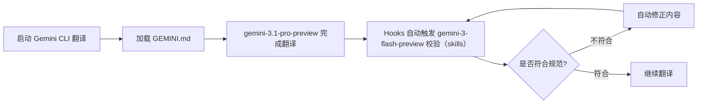

为了强化对某项特定技术的理解与实践，我经常会利用空余时间阅读并翻译该技术领域的相对较前沿的英文书籍，自从 ChatGPT 发布以来，翻译外文书籍越来越方便。即便如此，翻译一本书还是需要非常多的繁杂的规则，例如：交叉引用、公式编号、字体使用规范、图片引用规范、排版规范……这些规范在我翻译书籍的过程中往往占据了大量的时间。

恰好最近在研究 Harness Engineering，突然我想：写代码与翻译在本质上不都是生成吗？Transformer 架构最初不也是为机器翻译而提出的吗？于是我就想把 Harness Engineering 的思想应用到书籍翻译上来，并依此来分析一下 Harness Engineering 的效果。


<!--more-->

## Harness Engineering
2026 年 2 月 5 日，Mitchell Hashimoto 在他的博客 *My AI Adoption Journey*[^4] 中提出了 Harness Engineering 这个概念。

> I don't know if there is a broad industry-accepted term for this yet, but I've grown to calling this **"harness engineering"**.
> 
> It is the idea that **anytime you find an agent makes a mistake, you take the time to engineer a solution such that the agent never makes that mistake again**. I don't need to invent any new terms here; if another one exists, I'll jump on the bandwagon.

这就是 Harness Engineering 最初的含义：当你发现 Agent 犯错的时候，需要采用系统化的方案来确保 Agent 不再犯类似的错误。

然后，Cursor、OpenAI、Anthropic 先后发布了各自在 Agent-First 软件开发上的实践报告[^1][^2][^3]。这三篇实践报告均指向了 Mitchell Hashimoto 文章中的一个术语：Harness Engineering，从而引爆了 Harness Engineering 的浪潮。

于是一个混乱的时代到来了，就像我在 [什么是微服务](/monolith-to-microservices/docs/What_Are_Microservices.html) 里提到的那样：虽然我们是在讨论同一个术语，但是实际上我们却是在讨论不同的东西。

仔细阅读 Cursor、OpenAI、Anthropic 的实践报告之后，我发现，虽然他们都提到了 Harness Engineering，虽然这三篇文章的读者群高度重叠，虽然用的术语高度一致，但各自回答的工程问题截然不同[^5]:

- 时间维度：Anthropic 研究的是如何让 Agent 更长时间的自主运行。
- 空间维度：Cursor 研究的是如何让几百个 Agent 能并行自主工作。
- 协作维度：OpenAI 研究的则是当 Agent 的产出速度远超人类的注意力时，人应该通过什么方式来控制整个系统。

后来，我想了好久，终于想通了——其实理解 Harness Engineering 可以从多个维度切入：
- 从问题空间来看：它主要解决智能体重复犯相同错误、自主运行时长有限、输出结果不符合预期等问题。
- 从解决空间来看：它为大模型系统性地构建约束空间、引导模型沿着有限路径、高效朝着预设目标推进。
- 从最终效果来看：它实现了智能体自主化、长时程、可管控的稳定运行。

所以，Harness Engineering 也可以看作是一种面向失败、面向不稳定性开发的有效实践范式。


## 翻译书籍的复杂性
在 Chat 模式时，大模型可以帮助我完成从英文到中文的初步翻译过程，这个过程也就仅仅是把内容从英文变成中文，除此之外剩下的大部分的工作还需要我来处理：

- 字体样式的统一
- 交叉引用的统一
- 翻译术语的前后统一
- ……

如果涉及到数学公式，还需要做更多的工作……

**仔细分析，就会发现，这些复杂性恰好是 Harness Engineering 最开始要解决的问题**：

> 当你发现 Agent 犯错的时候，需要采用系统化的方案来确保 Agent 不再犯类似的错误

只要告诉 Agent，在翻译过程中需要遵循什么样的规范，遇到图要怎么处理、遇到公式要怎么处理、遇到交叉引用要怎么处理…… Agent 自己就可以按照这个规范生成正确的内容。

想想我自己的翻译过程，也是如此：当我间隔很长时间没有翻译的时候，在继续翻译的时候我也会翻一下之前的规则，来保障整本书的统一。Harness Engineering 只是把我脑子中的那些规则固化下来而已，从而解决了 Agent 重复犯错的问题。

## 我的实践
为了验证我的想法，我找到了 2 年前的一个翻译项目：[Introduction to Probability and Statistics for Engineers and Scientists(Sixth Edition)](https://github.com/wangwei1237/introduction_to_probability_and_statistics)。这本书从 2025 年 2 月开始就没有持续翻译了，也算是一个有着历史包袱的遗留项目，要在这种项目上引入 Harness Engineering 并让 Agent 继续工作下去，说实话，心里确实没底。

说干就干，开搞。我用到的所有的内容如下：
- [GitHub 仓库](https://github.com/wangwei1237/introduction_to_probability_and_statistics)
- Gemini CLI（模型选择gemini-3.1-pro-preview）
- chrome-devtools-mcp 工具
- 英文原版 PDF 书籍（book_en.pdf）

### 花若盛开，蝴蝶自来
在与 AI 协作的时候，我们有时候表现得就像我们讨厌的 “老登” 一样，我们会没有任何依据的先给 AI 灌输一堆的知识、信息，并号称 AI 需要这些知识，否则他就没法生成符合预期的结果。这听起来非常有道理的样子……

但是，我比较懒，在重新翻译的时候，因为中间隔了 1 年之久了，我也不想再去翻看之前的翻译、去回忆总结那些规则作为知识并灌输给 AI……

我甚至都不想告诉 Gemini CLI 需要怎么分页，用什么工具可以分页……

我坚信，不试试怎么知道 Gemini CLI 会不会呢？在不探测别人的能力时强行输入一堆知识确实像一个 “老登”，还好，这次我忍住了想当一个 “老登” 的欲望。

我在 Gemini CLI 中输入的如下的内容，我仅仅给出了任务描述，没有提前输入任何的额外的知识：

> 按照要求，翻译 @book_en.pdf 的 14.2 的内容。

我观察到，在没有输入任何知识的时候，Gemini CLI 自己会去搜索我翻译的其他章节的内容，并从中自己提炼相关的规则。


效果非常惊艳，我只是给了明确的任务，Gemini CLI 大概花了 40 分钟的样子自己完成了所有的工作，中间我没有做任何的修改和提示。

- 自己读取 PDF 的内容，并非常精准地提取了 14.2 节的原内容
- 自己去回顾我翻译过的历史章节内容，提取对应的规则

最终的效果参见 [14.2 失效率函数](/introduction_to_probability_and_statistics/chapter_14/14.html#sec-14_2)，完全符合预期。

### 保存 AI 总结的知识
翻译整本书不是一个 session 就能解决的，如果明天我重新打开 Gemini CLI 开始新的任务时，我可不想让 Gemini 再浪费时间去学习那些规则，是时候记住一些东西了。于是，我在 Gemini CLI 中先让 Gemini 自己反思一下：

> 从这次翻译过程中，你学习到了哪些项目的规范，请逐一列举，不要遗漏。


### 除非必须，绝不多嘴
然后，我继续让 Gemini CLI 来翻译 14.3 节，但是这一节中增加了很多上一节中不存在的规则，例如：
- 图的处理
- 有的习题题目和答案是放在一起的，没有区分 `练习` 部分和 `答案` 部分
- 复杂公式

我不想做 “老登”，我只在观察到 AI 明显犯错的时候才系统化地给出知识和规则，于是在和 Gemini 交互了多次后，`GEMINI.md` 中的知识也不断地丰富了起来。


随着规则越来越多，我与 Gemini CLI 的交互也越来越少，Gemini CLI 可以更长时间的自主翻译。对于 14.4 和 14.5 章节的翻译，我只是给出了任务，中间没有做过任何的干预，Gemini CLI 的翻译产出已经能够做到 PASS@1。 现在 `GEMINI.md` 的内容如下所示：

``````
## 开发规范（翻译与排版约定）

### 1. 文件组织
- **章节主文件**：每个章节的主文件（如 `14.qmd`）的一级标题应翻译为中文，并保留锚点（如 `# 寿命测试 {#sec-14}`）。
- **小节标题层级**：在子章节文件（如 `14_2.qmd`）中，小节标题使用 `##`，更深层级依次递增。

### 2. 术语翻译
- **中英对照**：专业术语首次出现或定义时，使用 **中文加粗** 后接 (*英文斜体*) 括号标注。示例：**失效率函数**（*hazard rate function*）。
- **关键术语**：正文中提到的核心概念应使用加粗。保持全书一致性，如 **最大似然估计量** (*maximum likelihood estimator*)。

### 3. 交叉引用与锚点
- **标题锚点**：每个标题后需紧跟 ID 锚点，格式为 `{#sec-章节号_小节号}`。
- **公式锚点**：公式需编号，格式为 `{#eq-章节号_小节号_序号}`。
- **定理锚点**：定理需编号，格式为 `{#thm-章节号_小节号_序号}`。
- **定义锚点**：定义需编号，格式为 `{#def-章节号_小节号_序号}`。
- **推论锚点**：推论需编号，格式为 `{#cor-章节号_小节号_序号}`。
- **表格锚点**：表格需编号，格式为 `{#tbl-章节号_小节号_序号}`。
- **图形锚点**：图形需编号，格式为 `{#fig-章节号_小节号_序号}`。
- 示例锚点：习题与解答成对出现时，习题编号为 `{#exr-章节号_小节号_序号}`。
- 示例答案锚点：习题与解答成对出现时，解答编号为 `{#sol-章节号_小节号_序号}`。
- 独立示例锚点：只有习题或例题（无独立解答块）时，使用 `{#exm-章节号_小节号_序号}`。
- 引用语法：使用 `@sec-ID`、`@eq-ID`、`@thm-ID`、`@def-ID`、`@cor-ID`、`@exr-ID`（习题）、`@sol-ID`（解答）、`@exm-ID`（独立示例）、`@tbl-ID`（表格）、`@fig-ID`（图形）等进行自动交叉引用。**禁止使用纯文本“示例 X.X”进行引用**。

### 4. 示例与解答格式
- **专用块 ID**：示例（Example）和解答（Solution）必须包裹在 Quarto 自定义块中：
    - 习题与解答配对：
        - 习题：`::: {#exr-章节号_小节号_序号}`
        - 解答：`::: {#sol-章节号_小节号_序号}`
    - 独立示例（无独立解答块）：
        - 示例：`::: {#exm-章节号_小节号_序号}`

### 5. 数学公式与排版
- **独立定界符**：行外公式的 `$$` 定界符必须**各自独占一行**。
- **对齐环境**：复杂推导优先使用 `\begin{align} ... \end{align}`，且必须包裹在 `$$ ... $$` 中以确保公式编号正常显示，示例：
  ```
  $$
  \begin{align}
  公式内容...
  \end{align}
  $$ {#eq-ID}
   ```
- **符号约定**：
    - 均值：`\overline{X}` 或 `\bar{x}`
    - 分布：`\sim`
    - 正态分布：`\mathcal{N}`
- **中西文间距**：中文与行内公式 `$ ... $` 之间应保持一个半角空格。

### 6. 绘图规范 (R Graphics)
- **代码绘图**：原书中的示意图（如时间轴、分布图等）应优先使用 R 代码块（`ggplot2`）生成，而非使用静态图片。
- **标签语言**：R 代码块生成的图形中，所有文本标签（label）、轴标题（axis title）和数学符号应**保持英文**。
- **图形引用**：需配置 `#| label: fig-ID` 并使用 `@fig-ID` 引用。

### 7. 语言风格与校对
- **语气**：保持严谨、客观的学术叙述风格。
- **标点**：正文使用全角中文标点；数学环境内使用西文标点。
- **OCR 校验**：严格审查 OCR 识别导致的同音错别字（如将“贝叶斯”识别为“贝育”）。
``````

### 自动校验与评估
Anthropic 的博客中提到了模型 *自我评价失灵* 的问题，也就是说：当我们要求模型评价自己的作品时，即便这些作品非常一般，Agent 也倾向于自信地赞美。

> A second issue, which we haven’t previously addressed, is **self-evaluation**. When asked to evaluate work they've produced, agents tend to respond by confidently praising the work—even when, to a human observer, the quality is obviously mediocre. This problem is particularly pronounced for subjective tasks like design, where there is no binary check equivalent to a verifiable software test. Whether a layout feels polished or generic is a judgment call, and agents reliably skew positive when grading their own work.

但是，当 Gemini CLI 翻译完之后，我也不想去 Review 翻译的内容对不对、格式对不对、图对不对……

于是，我想让 Gemini CLI 在完成编译之后自动触发 `gemini-3-flash-preview` 模型来进行自动校验，如果存在不符合规范的地方，Gemini CLI 再自动修正……




关于 Hooks 和 Skills 的详细内容，可以参见 GitHub 代码仓库：
- Hooks：[settings.json](https://github.com/wangwei1237/introduction_to_probability_and_statistics/blob/main/.gemini/settings.json)
- Skills：[translation-reviewer](https://github.com/wangwei1237/introduction_to_probability_and_statistics/blob/main/.gemini/skills/translation-reviewer/SKILL.md)
- Script：[validate_edit.sh](https://github.com/wangwei1237/introduction_to_probability_and_statistics/blob/main/scripts/validate_edit.sh)

## 模式的转变
在 Harness Engineering 的模式下，确实如 OpenAI 的博客中所述的 *Humans steer. Agents execute* 那样，我真的：
- 再也没有手动翻译过任何的一个单词
- 再也没有手动把原书中的图转换成 `R` 代码
- 再也没有手动处理过任何一个 LaTeX 公式
- ……

在翻译过程中，我所做的工作变成了：
- 在必要的时候给 Gemini CLI 提供知识与规则
- 构建自动化评估的机制
- 编写评估所用的 Skill（其实 Skill 本身也是 Gemini 生成的）
- 给 Gemini CLI 明确的任务
- ……

当然，与 AICoding 相比，AITranslating 的复杂度确实低很多，但是模式是那么的相似、目标也是那么的一致：*Humans steer. Agents execute*。

更理想的状态应该是构造完知识、规则、环境与工具后，把一本英文的 PDF 书籍丢给 Gemini CLI，Agent 自己就会拆解为多个子任务（按照章节粒度翻译），然后按照如上的流程逐章节进行翻译并自动校验。于是，一个更长程的翻译任务也就跑起来了。

## 参考文献
[^1]: [Towards self-driving codebases](https://cursor.com/blog/self-driving-codebases)
[^2]: [Harness engineering: leveraging Codex in an agent-first world](https://openai.com/index/harness-engineering/)
[^3]: [Harness design for long-running application development](https://www.anthropic.com/engineering/harness-design-long-running-apps)
[^4]: [My AI Adoption Journey](https://mitchellh.com/writing/my-ai-adoption-journey#step-5-engineer-the-harness)
[^5]: [Harness Engineering 在讨论什么：三个 Scaling 维度的统一框架](https://yage.ai/share/harness-engineering-scalability-20260330.html)