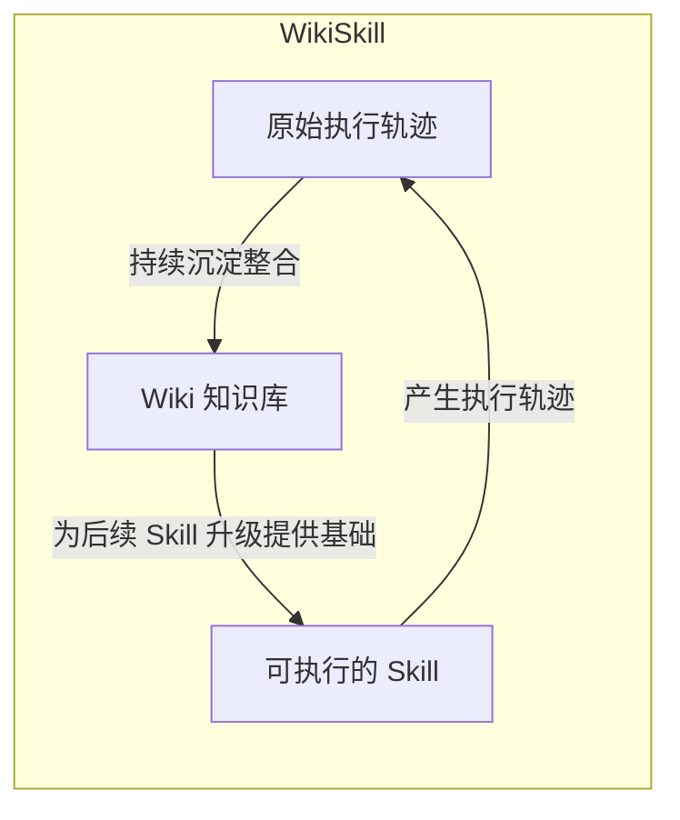
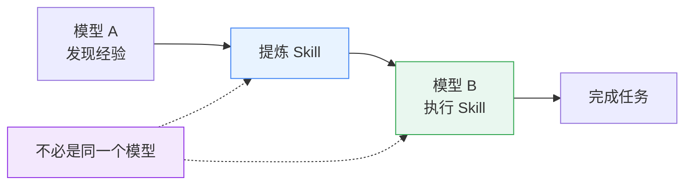

谷歌刚发布的关于 [WikiSkill: Compiling Agent Experience into Persistent Knowledge for Skill Evolution](https://arxiv.org/abs/2608.27454v1) 的论文值得认真的研究一下。

很多人都会说：这里面提到的好多观点我之前就提出过了。但是更为重要的是：谷歌没有停留在观点的浅薄层面，而是从实证的角度给出了可实践的理论支撑。

<!--more-->

论文中的两个分离蛮值的思考的：
1. 在 Skills 进化的过程中，把原始执行路径、知识库、Skills 进化分离开来；
2. 在 Skills 进化的过程中，把 Skills 发现 与 Skills 执行这两个阶段分离开来；

同时，论文中提出的：Skills 进化与 LLM Scaling 的互补性、Skills 进化的可迁移性也是我们在 Agent 自进化过程中特别需要关注的地方。

## 术语

- Self-evolved skills：模型 A 从自己的轨迹中演化 Skill，模型 A 再使用这个 Skill 执行任务。
- Ablation studies（消融研究）：刻意去掉模型或系统中的某个组件、模块、特征、损失项，观察性能下降多少，以此证明这个组件是否有用、贡献有多大。简单来说，就是拿掉一部分，观察效果相差多少，从而验证它的价值。
- Procedural knowledge：操作、流程、步骤、技能和执行序列；告诉 Agent **如何完成一件事**，是一种可执行的知识。

## Abstract

> Agent skills package **specialized knowledge and workflows** into reusable resources that extend AI agent capabilities. Recent work **automatically discovers such skills** from agent experience, which enables agents to progressively adapt through interaction. However, the **insights that guide skill development** typically remain scattered across optimization histories, limiting their systematic reuse across iterations.

- Insights：并非泛指所有运行日志，而是从成功或失败中得到的、对未来有用的认识。原始轨迹是事实，Insight 则是从事实中抽象出的可复用规律。例如：
  - Agent 为什么失败；
  - 哪种操作顺序更可靠；
  - 哪类错误反复出现；
  - 某个 Skill 规则为什么有效；
  - 某个修改为什么被拒绝；
  - 某个方案只适用于小模型，还是具有普遍性。

```text
表面现象：
Agent 重复拿起、检查、放回同一个物品。

Insight：
Agent 没有记录“某个物品已经执行过哪些操作”，
所以它会把同一状态误判成新的任务进展。

可执行规则：
每种操作对同一物品最多执行一次。
```

- Scattered across optimization histories：指 Skill 经历多轮迭代优化后，有用信息可能散落在不同地方。例如：

```text
第 1 轮失败轨迹：发现 Agent 会重复操作
  → 信息位于 trace

第 2 轮分析日志：怀疑缺少状态追踪
  → 信息位于分析器输出

第 3 轮 Skill 提案：加入一个抽象的“面向目标行动”规则
  → 信息位于 Skill diff

第 3 轮验证记录：该规则没有提高成绩，被拒绝
  → 信息位于拒绝记录
```

> We introduce WikiSkill, a framework that co-evolves agent skills with a persistent knowledge base (wiki). At a high level, WikiSkill **separates raw execution experience, accumulated knowledge, and executable skills**, while continuously consolidating experience into the wiki, which subsequent skill updates can build on.



> We find that skill evolution complements model scaling: larger models generally benefit more from evolved skills, while smaller models with skills can outperform substantially larger models without them.

Skill 演化与模型 Scaling 之间具有互补关系，而非替代关系：更大的模型通常能从不断进化的 Skill 中获得更多收益。同时，具有优质 Skill 的小模型，也可能超过没有对应 Skill、参数规模更大的模型。对于 LLM + Skills 范畴下的 Agent，其能力提升可以表示为：

$$\text{Agent\_Capability} = \text{LLM\_Scaling} \times \text{Skills\_Evolution}$$

| 能力来源 | 主要提供什么 |
| --- | --- |
| LLM Scaling | 更强的理解、推理、规划、代码生成和指令执行能力 |
| Skills Evolution | 特定任务的流程、经验、失败规避规则和工具使用方法 |

模型越大，越能释放 Skill 的能力。经验越丰富的工程师，越能理解条件、组合步骤并处理异常。因此，面对同样的操作手册时，他们更可能取得优秀的结果。

> We also find that evolved skills transfer effectively across models and model families, and skills evolved by other models can outperform self-evolved skills.

Skill 不是模型内部参数的一部分，而是一种可以独立保存、共享和复用的外部程序性知识。因此，Skill 演化表现出较好的跨模型迁移能力。“跨模型迁移”意味着 Skill 学到的不只是某个模型的临时行为，而是模型无关、任务相关的程序性知识。

其他模型演化出的 Skill 可能更好，这意味着：对于大模型而言，“发现知识”和“执行知识”是两种不同的能力。最优秀的操作手册作者和最优秀的操作人员不一定是同一个人。

因此，在实际应用中，我们更应该将“Skill 演化”和“Skill 执行”区分开：用更适合知识发现的模型实现“Skill 演化”，用具备更强理解和执行能力的模型“执行 Skill”。



> Finally, our ablation studies confirm that persistent knowledge accumulation in the wiki is critical for effective skill evolution.

## Introduction

> Developing effective skills, however, remains challenging. Most agent skills are **manually authored**, which requires anticipating the procedural knowledge and workflows that an agent will need. **This challenge** motivates recent work that iteratively develops agent skills by executing agents on training tasks, analyzing successful and failed trajectories, and refining skills based on the resulting experience.

从人工编写 Skill 转向基于训练任务自动生成 Skill。

> A key design question is how to preserve and organize what an agent learns throughout skill evolution. However, these methods do not maintain what has been learned as **a separate, evolving knowledge representation**.

- EvoSkill
- Trace2Skill
- SkillOpt

> **Can agent experience be similarly compiled into persistent knowledge to support long-term skill evolution?** We introduce WikiSkill, which adds a structured knowledge layer between raw experience and executable procedures. WikiSkill organizes the agent workspace into three layers: a Raw Layer that stores immutable execution traces, a Wiki Layer that maintains structured knowledge, and a Skill Layer that contains evolving **procedural knowledge**.


> These results suggest that skill discovery and skill execution are distinct capabilities.
