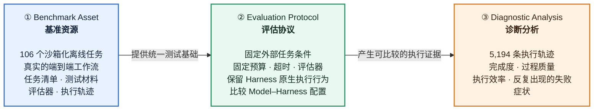

 2026 年 5 月，北京大学与启元科技的研究团队发布了论文 [Harness-Bench: Measuring Harness Effects across Models in Realistic Agent Workflows](https://arxiv.org/abs/2605.27922)，用于研究并评测不同 Harness 对 Agent 实际执行能力的影响。在论文中，作者提出了 Harness-Bench——一个包含 106 个沙箱化离线任务、用于在统一任务环境下比较不同 Model–Harness 配置的评测基准。论文发现，Agent 表现不仅取决于 LLM，也取决于 Harness 的执行机制。

 恰好最近在研究 Agent 评测，于是对这篇论文进行了精度，并做了如下的摘要。

<!--more-->

## 术语
- **oracle-checkability（预言机可检验性 / 自动真值可验证性）**：计算机科学、软件测试以及当前 AI Agent 评测与强化学习（RL）领域中最核心的概念之一。一个任务或问题，是否存在一个确定的、自动化的程序（Oracle / 预言机），能够客观、无歧义、无需人工介入地判定 Agent 的输出究竟是对还是错。
- **execution alignment（推理与执行对齐）**：智能体的推理、实际观察到的环境状态、通过工具采取的行动，以及评估器最终检查的成功条件之间，是否始终保持一致。
- **fixtures（测试固件 / 预置测试环境）**：预先准备好的测试资源集合，包括初始化数据、配置文件、数据库快照、沙箱状态、依赖文件、环境上下文。作用是让每个测试任务都从完全一致的初始状态开始运行，保证评测可复现。
- **agent-computer interface（ACI）**：指的是专门为 AI 智能体设计的一组观察方式、操作方式和反馈格式，使智能体能够理解计算机当前状态，并对计算机采取行动。就像 GUI 帮助人类用户操作计算机一样，ACI 帮助 AI 完成与计算机的交互。$\text{ACI} = \text{智能体能看到什么} + \text{智能体能做什么} + \text{计算机如何反馈}$

<!--more-->

## Abstract

> Each run records final artifacts, execution traces, usage statistics, and validator outputs, enabling analysis beyond final completion.

> Our analysis further identifies recurring execution-alignment failures, where plausible reasoning becomes decoupled from tool feedback, workspace state, evidence, or verifiable output contracts.

Agent 的推理过程看起来合理、流畅，甚至“知道应该做什么”，但 Agent 随后执行的操作和最终的产物却没有持续忠实地反映：工具返回的信息、工作区的真实状态、证据、任务规定的验收条件。

在 Agent 执行任务时，“想明白”不等于“完成任务”。Agent 必须确保每一步推理都由当前环境状态和证据支撑，工具结果会改变后续行动，而且最终意图会落实为符合验收规则、能够被独立验证的产物。

1. **与工具反馈脱节**：Agent 调用工具后，工具返回了错误或异常结果，但 Agent 没有根据异常信息调整执行计划，依旧沿着原来的推理继续执行。
    ```
    Agent：接下来我会读取配置文件。
    工具：文件不存在。
    Agent：接下来我将修改这个配置文件。
    ```

2. **与工作区状态脱节**：Agent 认为某个文件已经创建、修改或保存，但实际工作区中并没有发生对应变化，或者文件内容与 Agent 所说的不一致。
3. **与证据脱节**：Agent 给出了一个结论，但没有获取实际的执行日志、实际的测试结果来支持这个结论，甚至忽略了与结论相矛盾的证据。

    ```
    Agent：测试已经通过，问题已解决。
    实际测试执行：测试用例根本就没有执行。
    ```

4. **与可验证的输出契约脱节**：用户规定了明确的输出格式、文件结构或验收条件，Agent 生成的结果虽然内容大致合理，但却依旧不满足这些要求。
    ```
    任务明确要求输出格式：{"answer": "...", "confidence": 0.9}
    Agent 输出：我的答案是……我对此比较有信心。
    ```

## Introduction

> In such executable workflows, practical performance depends not only on the underlying model, but also on the system layer that turns model capability into executable action. We refer to this layer as a harness: the mechanism that organizes context, tools, state, permissions, constraints, and recovery to mediate between model outputs and external actions.


模型层是推理能力；其他层是执行能力。目前测评测集涵盖了：模型的静态推理、Agent 在可执行环境下的最终表现、以及标准工作流下的表现。但是，对于其他层（Harness）层的单独覆盖目前依然是缺失的。

> Harnesses are therefore central to agent system design: they shape how model capability is exposed, constrained, and realized, affecting completion, cost, safety, robustness, and auditability.

> However, existing efforts typically evaluate a particular agent system, standardize evaluation infrastructure, or compare heterogeneous agent stacks, rather than systematically varying harness configurations across shared task environments and model backends.

> Rather than forcing all systems into an identical internal implementation, Harness-Bench fixes the task environment, budget, timeout, and evaluator while preserving each harness’s native execution behavior.

> The resulting measurements should therefore be interpreted as configuration-level diagnostics of model–harness pairings, not as causal decompositions of individual harness mechanisms. Each run records execution evidence, enabling analysis beyond final completion scores.

Harness-Bench 能告诉我们“哪一种 Model—Harness 组合整体表现更好”，但不能直接告诉我们“究竟是哪一个 Harness 机制导致了这种差异”。

因此，比较的实际上是类似：

$(\text{GPT-5.4},\text{NanoBot 配置}) \quad\text{vs.}\quad (\text{GPT-5.4},\text{Hermes 配置})$

- Harness-Bench 可以评估出：在这套任务和实验条件下，GPT-5.4 + NanoBot 的整体表现优于 GPT-5.4 + Hermes。
- 但不能进一步断言：NanoBot 更好，是因为它的状态管理机制贡献了 8 分，错误恢复机制贡献了 5 分。

Harness-Bench 是一台“整机检测仪”，能够比较不同“模型 + harness”整机配置的表现，并根据执行轨迹诊断其失败症状；但它不是一套“因果实验”，不能仅凭这些结果确定某个提示词、工具接口或状态管理机制单独造成了多少性能变化。

Harness-Bench 的整体框架如下所示：


Harness-Bench 的三大贡献：



## Related Work
> LLM evaluation has progressed from static language and reasoning benchmarks to executable agent benchmarks

**executable** 不仅指 LLM 可以调用工具，更为重要的是：Agent 可以改变环境中的对象、改变环境的状态、并且结果具备可验证性。

LLM 评估已经从测试模型“能否用文本答对问题”，逐渐发展到测试 Agent “能否在真实或模拟环境中采取行动并完成任务”。

| 评估范式 | 静态基准                 | 可执行基准                            |
| ---- | -------------------- | -------------------------------- |
| 评估对象 | LLM 能力               | Agent 能力                         |
| 核心问题 | 模型能否给出正确答案？          | 智能体能否真正完成任务？                     |
| 输入   | 一段固定文本或题目            | 任务目标与可操作环境                       |
| 输出   | 文本答案                 | 操作过程、环境变化和最终产物                   |
| 交互方式 | 通常一次性作答              | 多轮观察—行动—反馈                       |
| 主要依据 | 答案是否正确               | 环境最终状态、测试和执行证据                   |
| 代表基准 | MMLU、GSM8K、BIG-bench | SWE-bench、OSWorld、Terminal-Bench |

> More recent workflow-agent benchmarks, including AgentBench, GAIA, and Claw-Eval, further emphasize multi-step execution, external state, traceability, safety, robustness, and cost-aware evaluation.
>
> ClawMark pushes this direction to long-horizon, multimodal coworker settings, coupling multi-turn and multi-day tasks with persistent tool-backed services and drifting external state.

> These benchmarks are essential for measuring model or end-to-end agent capability, but they do not directly evaluate the harness as the variable of interest: they either abstract away execution, evaluate a complete submitted agent stack, or hold the execution setup fixed to compare models.

目前的评测要么仅评测模型能力，要么仅评测 Agent 的端到端能力，并没有对 Agent 的 harness 层进行直接评测。

> Harness-Bench is complementary: it controls external task conditions while varying harness configurations, enabling diagnostic comparison of completion, token cost, execution safety, robustness, and traceability.

Harness-Bench 的实验结构可以表示为：
$$\underbrace{\text{相同任务、环境、预算、评估器}}_{\text{受控的外部条件}} + \underbrace{\text{不同 Harness 配置、Model}}_{\text{实验中变化的部分}}$$

> Work on agent-computer interfaces, tool-use protocols such as the Model Context Protocol, stateful and multi-agent frameworks, tracing, guardrails, memory, budget control, and recovery mechanisms reflects growing attention to the infrastructure that **turns model outputs into external actions**.

不同的 Agent 对 ACI 中的不同部分具有不同的实现策略。

## The Harness-Bench Benchmark
> Harness-Bench is a diagnostic benchmark for studying model–harness configurations in executable agent workflows. Each evaluation consists of a task, a model backend, a harness configuration, a sandboxed environment, and an evaluator. The benchmark fixes external task conditions while varying the harness surrounding the model, and records both final artifacts and execution traces.

> We use **harness** to denote the system layer that conditions model calls and turns model outputs into actions in an external workspace. A harness may include prompt templates, action formats, context construction, tool invocation, workspace access, permissions, budget control, tracing, and recovery.


### Harness-Level Evaluation Setting
> For each task and model backend, Harness-Bench fixes the user-facing task, initial sandbox state, budget, timeout, and evaluator, while varying the harness configuration.
>
> We do not force all systems into a common internal policy or runtime. Instead, each harness runs with its native execution behavior under the same task resources and evaluation protocol.
>
> The resulting measurements should therefore be interpreted as configuration-level diagnostics of model–harness pairings, not as causal decompositions of individual harness mechanisms.

Harness-Bench 可以评测不同的“LLM + harness”配置的整体表现，并根据执行轨迹诊断其失败症状，但无法评测 Agent 整体表现的“实际归因”。Harness-Bench 无法给出究竟是 Agent 中的哪些部分导致了最终的结果。

### Task Suite Design and Validation
> Harness-Bench contains 106 local, sandboxed tasks designed to evaluate end-to-end agent workflows rather than isolated tool calls. Each task requires a deliverable and is paired with an oracle or rubric that checks completion from the final workspace state and, when needed, the execution trace.

评测样本的任务清单组织结构如下：
```
task_id: "006-access-bilibili"
title: "Access A Local Bilibili-Style Mock Page"
class: "Workspace, Tool Use & Multimodal Operations"
prompt_file: "prompt.txt"
fixtures_dir: "fixtures"
oracle_module: "oracle_grade.py"
hooks_module: "hooks.py"
timeout_sec: 900
tags:
  - "browser"
  - "local-http"
  - "web-extraction"
```

Harness-Bench 中覆盖的 8 个 Agent 场景：

| Category                                    |       # |
| ------------------------------------------- | ------: |
| Software Engineering & Codebase Maintenance |      22 |
| Data, BI & Finance Analytics                |      14 |
| Workspace, Tool Use & Multimodal Operations |      15 |
| Knowledge, Evidence & Retrieval             |      13 |
| Office & Business Communication             |      12 |
| Vertical Professional Workflows             |      12 |
| Long‑running Autonomy & State Adaptation    |      11 |
| SRE, DevOps & Release Ops                   |       7 |
| **Total**                                   | **106** |

> Each candidate task is manually reviewed before inclusion. We retain tasks only when they satisfy four criteria:
>
> **Realism**, reflecting a plausible user workflow;
> **Solvability**, meaning the task can be completed using the provided sandbox resources;
> **Oracle-checkability**, meaning success can be verified by deterministic checks or a specified rubric;
> **Integrity**, meaning agents cannot obtain credit by reading hidden answers, modifying protected fixtures, or bypassing constraints.

每个任务都必须经过人工审核才能加入到评测集中，每个任务都必须满足 4 个条件：真实；可解决；可判别；正直诚实。

### Run Protocol and Evidence Collection
> Each run produces four sources of evidence: the final workspace state, execution trace, usage statistics, and validator outputs. These support completion scoring, process diagnostics, cost analysis, permission checks, and failure analysis.


每个任务的执行都会做如下的操作：
$$
R = \mathrm{Run}(M, H, E, T), \quad \mathrm{TaskScore} = \mathrm{Eval}(R; J)
$$
where $M$ is the model, $H$ is the harness configuration, $E$ is the sandboxed environment, $T$ is the task, $R$ is the final results, and $J$ is the evaluator.

### Scoring and Metrics

For task $i$, the overall score is:

$$
\begin{equation}
\mathrm{TaskScore}_i = \mathrm{Security}_i \cdot \mathrm{Completion}_i \cdot \mathrm{Process}_i,
\end{equation}
$$

$$
\begin{equation}
\mathrm{Process}_i = \frac{\mathrm{Robustness}_i + \mathrm{ToolUse}_i + \mathrm{Consistency}_i}{3}
\end{equation}
$$
where $\mathrm{Security}_i \in \{0,1\}$ and all non‑binary scores are normalized to $[0,1]$.


### Harness Dependence
> We use **harness dependence** to describe how much a model backend’s performance varies across harness configurations under otherwise shared benchmark conditions.

> This pattern suggests that stronger models may be more tolerant of differences in prompting, tool interfaces, state management, and recovery behavior.

更强大的模型，对于不同 Harness 之间的兼容性更好。
