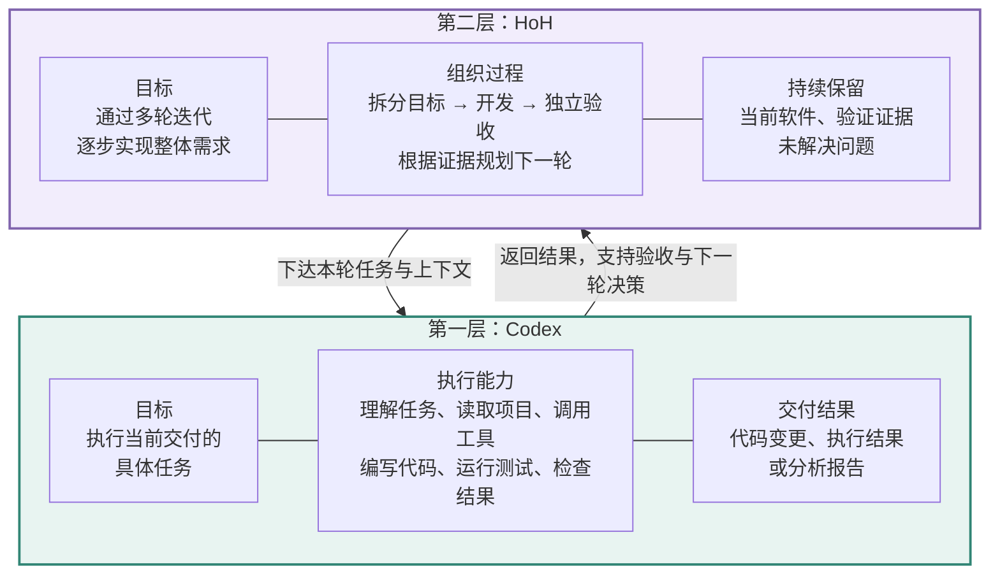

在 Coding Agent 的实践过程中，我时常在想：
- 有了必要的知识、workspace、skill、tool 等，Coding Agent 是否就足够了呢？
- 人在面对同样的需求的时候，又是怎么开发的呢？

恰好，最近发现上海人工智能实验室发表了论文 [Harness of Harness:Multi-Day Autonomous Software Development with Continual Improvement](https://flesymeb.github.io/HarnessOfHarness/)，在论文中，研究者们利用 HoH 在无人工干预的情况下，花了 6 天时间、历经 70 多次 Loop 完成了一个 FPS 游戏。

<!--more-->

## 给 Agent 一个大需求，然后呢？

!!! note "当前 Harness Engineering 的现状"

    我们给 AI 一个需求：“做一个能玩的游戏”。第一版出来了，但有些功能没做完，有些地方不能用。接下来，在 Looping 中，Agent 会根据我们提供的知识、工具、测试结果来修复，然后不停的 Looping 整个循环……

    于是，Agent 开始陷入了无休止的局部修复循环……

    **接下来，需要人介入，并打破这个循环，并进行新的规划……**

在 HoH 的论文中，作者把这个现象称作：**repetitive local repairs**。

!!! note "提示"
    人类工程师在开发一个需求的时候，不是一蹴而就的，而是每次完成一个小的功能点，然后不停的迭代直到完成整个需求……

    团队在开发产品的时候，也是敏捷迭代开发。

论文中的 Harness of Harness 的核心思想其实就是借鉴了人类工程师开发过程中的小步快跑的迭代思想，并把这套思想抽象成了一层工程 Harness 层。

与其说是**HoH**，倒不如说是：围绕现有 Coding Agent 的能力（Codex、Claude Code……），对软件开发需求组织持续的规划、开发与测试，让一轮的结果能够指导下一轮，并最终完成需求。

## HoH 的具体应用案例

!!! note "HoH 的概念"
    **we introduce Harness-of-Harness (HoH), a framework that equips coding agents with continual improvement capabilities for autonomous software development.**

- **continual improvement capabilities**：软件功能的持续增加和迭代
- **autonomous**：全自主的开发过程


上海人工智能实验室团队用 HoH，用时 6 天，迭代了 70 多次，在无人接管的情况下完成一个可玩的 FPS 游戏。


*图：作者官网的 Fusepoint 实机展示封面。[打开官网视频](https://flesymeb.github.io/HarnessOfHarness/)。*

整个迭代的过程如下图所示：


- **横轴**是迭代次数，纵轴是尚未关闭的问题数量
- **横轴上方**的蓝色、紫色标记分别表示新发现问题和已关闭问题
- **曲线与浅色点**展示问题数量的趋势与记录值
- **截图与标签**标示开发成果，从初始原型、地图和武器，逐步扩展到音效、界面、动画、战斗 AI 和可玩版本。

在迭代 70 个 Loop 之后，作者发现：开发并非单调改善，验证过的行为仍可能会因为后续的修改而破坏（**人类工程师也存在这个问题**）。
- 81 个问题中关闭了 65 个，仍有 16 个未解决
- 有 17 个问题曾因回归测试而重新打开

对如上的图的分析，我们可以得到如下的结论：

**1. 问题数量上升不能直接等同于质量下降。** 一个尚未运行的空项目可能“没有已知问题”，但不代表质量高。新增功能扩大了可测试范围，也会暴露更多缺口。因此，应结合功能完成情况一起解读曲线。

**2. 问题关闭也不等于永久解决。** 长期迭代需要保留验证历史，并持续检查回归。否则，下一轮可能在不知道的情况下破坏上一轮成果。

## HoH 管的是整个开发过程

HoH 负责的其实是整个开发过程，也就是整个敏捷迭代过程中的非开发部分：
- 拆分目标任务
- 评估具体整体目标的差距
- 独立验收
- ……

!!! note "两层 Harness，而不是对原有 Harness 的再次约束"
    HoH 部分的内容，恰恰是我们目前的 Workspace 中的知识、rules、Skills 中所缺失的内容。而 HoH 所做的就是把这一层也给工程化、Harness 化。



$$
(A_{t-1}, \mathcal{E}_{t-1}) \xrightarrow{\text{loop } t \text{ under } \mathcal{S}} (A_t, \mathcal{E}_t)
$$

- $A_t$ denote the software artifact state after loop $t$
- $\mathcal{E}_t$ denote the execution evidence state obtained by evaluating $A_t$
- $\mathcal{S}$ denote the software specification, PRD

整个 HoH 的流程如下图所示：


*左上需求 → 上方 Planner → 右下 Developer → 左下 QA → 返回 Planner。*

可以用“执行环境”和“项目组织”来理解两层分工：

```text
第二层：HoH
决定本轮目标 → 安排开发 → 组织验收 → 根据结果重新规划
                         │
                         ▼
第一层：已有 coding harness
读文件、使用工具、修改代码、运行与检查程序
```

图中央的 harness 是执行基础，外圈负责组织其参与整个项目。三个角色可以使用同一个模型，分别承担规划、开发与验收职责。

HoH 通过三个角色组织每轮迭代的开发：

| 角色              | 通俗理解                        | 每轮交付   |
| --------------- | --------------------------- | ------ |
| Project Planner | 想清楚这一轮值得做什么，基于上次迭代的产物和评估来规划 | 开发文档   |
| Developer       | 把这一轮目标做出来                   | 更新后的项目 |
| QA Tester       | 实际检查做到什么程度                  | 证据包    |

Project Planner 从之前的迭代证据中生成本轮计划：

| 发现什么 | 计划怎么变 | 用人话说 |
|---|---|---|
| Unresolved Gaps | Prioritized Task Scope | 没完成的事情，挑重要的做 |
| Verified Behaviors | Preservation Constraints | 已经能用的东西，别改坏 |
| Task Specification | Validation Requirements | 什么现象出现，才算做完 |

**因此，开发计划不只是待办清单，还必须写“保留什么”和“怎么验收”。**

!!! caution "为什么同时保存代码和证据"
    * 代码说明“项目目前有什么”
    * 证据说明“哪些功能实际验证过，还有哪些问题”

    只看代码，很难知道一个按钮是否真正点过，失败路径是否跑过。

> Throughout this process, HoH specifies the artifacts and evidence that agents must deliver, but does not prescribe a rigid workflow for producing them.

## 实际开发中，我们是怎么迭代的？

!!! note "整体需求"
    **做一个平台跳跃游戏，玩家能移动、跳跃、穿过障碍、到达终点，并重新开始。**

这个需求可以按“玩家能完成什么行为”拆成可验证的增量迭代开发。

### 第一轮：先有一个能走通的小流程

目标可以很简单：

```text
目标：玩家可以移动、跳跃，并从起点走到终点。
范围：单个测试关卡、基础碰撞、终点检测。
验收：从启动游戏到到达终点，实际操作跑通一次。
```

RD 做完后，QA 验收：

| 检查项 | 观察 | 结论 |
|---|---|---|
| 左右移动 | 输入后位置正常改变 | 已验证 |
| 跳跃 | 能起跳并落地 | 已验证 |
| 边缘碰撞 | 某个平台边缘会穿透 | 有缺口 |
| 到达终点 | 位置到达，但没有完成提示 | 有缺口 |

这里最重要的变化是：下一轮接收到具体问题和已验证行为，不必只依赖一句“基本完成”。

### 第二轮：修复问题，同时补齐一段用户体验

根据上轮证据更新计划：

```text
本轮任务：
- 修复平台边缘穿透。
- 到达终点后显示胜利界面。

保留约束：
- 已验证的左右移动和跳跃继续有效。

验收：
- 重放平台边缘跳跃路径。
- 实际到达终点，确认胜利界面出现。
```

整体画面美化可以留到后续轮次，当前范围聚焦于碰撞修复和胜利反馈。

**小增量的价值是让变化和结果能够对应。** 如果一轮同时改碰撞、菜单、存档和地图，失败时就很难知道是哪一部分造成的。

### 第三轮：把“可见”补齐为“可用”

下一轮目标可以变成：进入胜利状态后停止角色输入，增加重新开始，并恢复初始状态。

验收需要连续执行：

```text
启动 → 移动与跳跃 → 到达终点 → 胜利 → 重开 → 再次移动
```

### 三轮之后，发生了什么？

| 轮次  | 软件增长        | 留给下一轮的知识         |
| --- | ----------- | ---------------- |
| 1   | 有基础可玩路径     | 哪些控制正常、哪里会穿透     |
| 2   | 碰撞修复、完成提示出现 | 胜利状态仍有交互缺口       |
| 3   | 胜利与重开形成完整流程 | 基础闭环可作为后续关卡的保留要求 |

需求仍是原来的需求，但实现顺序会随着观察结果调整。这就是“大需求逐步完成”最容易理解的过程。

## 实验：结构化循环比简单续跑好吗？

### 先看主结果

论文比较了三种 harness–model 配置。[官方结果表](https://flesymeb.github.io/HarnessOfHarness/)：

| 配置                         |   GameCraft 游戏质量分 | FrontierSWE Dominance | ProgramBench 平均测试通过率 |
| -------------------------- | ----------------: | --------------------: | -------------------: |
| Codex + GPT-5.5            | 49.58 → **71.52** |         44% → **71%** |  60.41% → **66.50%** |
| OpenCode + DeepSeek-V4-Pro | 26.90 → **48.98** |         25% → **44%** |  45.27% → **57.56%** |
| Pi + MiniMax-M3            | 42.16 → **58.78** |         35% → **64%** |  35.83% → **52.68%** |

### 最关键的追问：是不是因为多花了 token？

下面是论文对 Codex 的开发次数对照，均使用 GameCraft 质量分。[论文表 2](https://arxiv.org/html/2609.01481v1#S4.SS3)

!!! info "HoH 的 Tokens 消耗量会更多，但是效果也更好。"
    HoH 的 Tokens 消耗量会更多，但是效果也更好。

| 方法                   | 开发迭代轮次 | 得分    | Token 数量（百万） |
| -------------------- | ------ | ----- | ----------- |
| Vanilla              | 1      | 49.58 | 2.59        |
| Vanilla Continuation | 2      | 54.99 | 4.56        |
| Vanilla Continuation | 3      | 58.24 | 6.33        |
| HoH                  | 1      | 59.71 | 2.88        |
| HoH                  | 2      | 64.84 | 5.67        |
| HoH                  | 3      | 71.52 | 8.41        |

## 我们可以借鉴什么？

从工程分类上，可以把 HoH 理解为面向软件开发的一种具体循环设计。它的启发在于：**为每轮规定清楚输入、交付和证据，让后续工作有可靠依据。**

- **这一轮做什么？** 从整体需求和实际缺口中选择有限、完整的目标。
- **哪些旧功能不能坏？** 把已验证行为写入保留约束。
- **拿什么证明完成？** 用运行结果和可复查的证据支持验收。

代码与证据共同积累，下一轮规划时，根据上一轮的迭代信息、整体的目标信息综合规划，而不仅仅是 TO-DO List。
