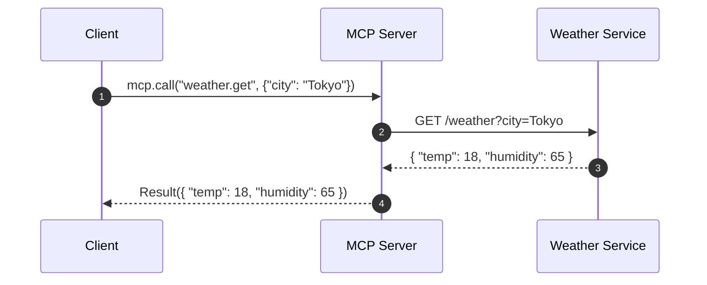

2024 年 11 月 25 日，Anthropic 在官方博客 [Introducing the Model Context Protocol](https://www.anthropic.com/news/model-context-protocol) 中正式开源了可以将各种工具链接到 LLM 的 MCP（*Model Context Protocol*）协议，以增强 LLM 的能力。

> Today, we're open-sourcing the Model Context Protocol (MCP), a new standard for connecting AI assistants to the systems where data lives, including content repositories, business tools, and development environments. Its aim is to help frontier models produce better, more relevant responses.
<!--more-->

## 缘起
起初的时候，MCP 并没有引起我的注意，因为根据 [MCP 官方文档](https://modelcontextprotocol.io/introduction) 中对 MCP 架构的描述可知，宿主程序通过 `MCP-Client` 和 `MCP-Server` 进行通信以获得当前可用的外部工具列表信息，同时宿主程序通过 `MCP-Client` 向 `MCP-Server` 发送请求以获得具体的外部数据或者外部 API 的调用。

以获取天气信息的场景为例：宿主程序通过 `MCP-Client` 向 `MCP-Server` 发送请求以获取天气信息，`MCP-Server` 会调用具体的天气服务 API 获取结果并返回给 `MCP-Client`。

而这个过程实际上和 OpenAI 的 [`Function Calling`](https://platform.openai.com/docs/guides/function-calling?api-mode=responses) 没有太大区别，表面上看起来仅仅是对工具的发现方式进行了重新定义而已。看起来，MCP 引入了 `Client` 和 `Server` 的概念，实际上只是将 `Function Calling` 中的工具发现和调用进行了拆分，本质上并没有带来新的东西。因此，当 MCP 刚刚发布的时候，我只是简单看了一下而已，并没有深入研究。

直到 2025 年 3 月的时候，MCP 突然爆红，成为了 LLM 领域的热门话题。
* 3 月 8 日，LangChain CEO Harrison Chase 与 LangChain 创始工程师、LangGraph 负责人 Nuno Campos 围绕着 [*MCP 是真正的技术突破，还是 AI 炒作浪潮下的又一朵浪花？*](https://blog.langchain.dev/mcp-fad-or-fixture/) 这一话题展开了激励的讨论。在讨论中，Harrison 更看好 MCP，并认为如果需要向无法控制的智能体中引入工具，MCP 就是最好的选择。而 Nuno 则认为，MCP 的潜力上限也就到 Zapier 这个程度了，它至少得变得更像 OpenAI 的自定义 GPT，才配得上大家如今对它的关注和期待。
* 3 月 9 日，LangChain 在 [X 平台上发起了一项投票](https://x.com/LangChainAI/status/1898410721215750487)：结合实际用例、与 OpenAI Plugin 的比较以及 MCP 自身的局限性，大家认为 MCP 到底是昙花一现、还是未来标准？根据 473 个用户的投票结果显示，有 40.8% 的人认为 MCP 是未来标准，25.8% 的人认为 MCP 只是昙花一现，剩下 33.4% 的人选择观望。
  
* 3 月 27 日，OpenAI 的 CEO Sam Altman 在 [X 平台发消息称](https://x.com/sama/status/1904957253456941061)：我们很高兴在我们的产品中增加对 MCP 的支持，agent SDK 已经可以支持 MCP，并且 ChatGPT 桌面应用程序 和 API 也将很快就会增加对 MCP 的支持。OpenAI 对 MCP 的支持，无疑加速了 MCP 的发展，同时也意味着 MCP 成为行业标准的可能性也越来越大。
* 4 月，阿里云、腾讯云、百度智能云等云服务商也纷纷宣布支持 MCP 协议，进一步加速了 MCP 在国内的发展。
* 根据 [Smithery](https://smithery.ai/)、[modelcontextprotocol/servers](https://github.com/modelcontextprotocol/servers)、[modelscope MCP 广场](https://modelscope.cn/mcp) 等平台的信息，目前已经有上千款 MCP 工具可供使用，从此也可以看出 MCP 的社区生态发展之快。

真正令我心动、想要深入研究一下 MCP 的事情还是 4 月 8 日 Github 官方开源了自己的 MCP Server——[github-mcp-server](https://github.com/github/github-mcp-server) 以重新定义 GitHub 自动化。我自己平时使用 Github 比较多，很多项目都会采用 Github 的 Actions 触发相关的自动化流水线执行，早在 2021 年[调研 GraphQL](/2021/06/15/Preliminary-Exploration-of-the-GraphQL/) 的时候，就对 Github 的 API 进行了非常深入的研究。因此，Github MCP Server 的开源对我触动比较大，我第一次萌生了想看看 MCP 究竟是什么的想法。

于是，我开始疯狂的在 Github Copilot 中、在 Cline 中、在其他的开源 MCP Client 中不停的使用 Github MCP Server，也在不停的使用过程中慢慢的对 MCP 有了更新的认识。

本文将以 [mcp-client-cli](https://github.com/adhikasp/mcp-client-cli) 和 [github-mcp-server](https://github.com/github/github-mcp-server)、[weather-mcp-server](https://github.com/CodeByWaqas/weather-mcp-server)、[dbhub](https://github.com/bytebase/dbhub) 为具体的例子，来一步步的揭开 MCP 的神秘面纱。

## Function Calling

