2024 年 11 月 25 日，Anthropic 在官方博客 [Introducing the Model Context Protocol](https://www.anthropic.com/news/model-context-protocol) 中正式开源了可以将各种工具链接到 LLM 的 MCP（*Model Context Protocol*）协议，以增强 LLM 的能力。

> Today, we're open-sourcing the Model Context Protocol (MCP), a new standard for connecting AI assistants to the systems where data lives, including content repositories, business tools, and development environments. Its aim is to help frontier models produce better, more relevant responses.
<!--more-->

## 缘起
起初的时候，MCP 并没有引起我的注意，因为根据 [MCP 官方文档](https://modelcontextprotocol.io/introduction) 中对 MCP 架构的描述可知，宿主程序通过 `MCP-Client` 和 `MCP-Server` 进行通信以获得当前可用的外部工具列表信息，同时宿主程序通过 `MCP-Client` 向 `MCP-Server` 发送请求以获得具体的外部数据或者外部 API 的调用。


以获取天气信息的场景为例：宿主程序通过 `MCP-Client` 向 `MCP-Server` 发送请求以获取天气信息，`MCP-Server` 会调用具体的天气服务 API 获取结果并返回给 `MCP-Client`。


而这个过程实际上和 OpenAI 的 [`Function Calling`](https://platform.openai.com/docs/guides/function-calling?api-mode=responses) 没有太大区别，表面上看起来仅仅是对工具的发现方式进行了重新定义而已。看起来，MCP 引入了 `Client` 和 `Server` 的概念，实际上只是将 `Function Calling` 中的工具发现和调用进行了拆分，本质上并没有带来新的东西。因此，当 MCP 刚刚发布的时候，我只是简单看了一下而已，并没有深入研究。

直到 2025 年 3 月的时候，MCP 突然爆红，成为了 LLM 领域的热门话题。
* 3 月 8 日，LangChain CEO Harrison Chase 与 LangChain 创始工程师、LangGraph 负责人 Nuno Campos 围绕着 [*MCP 是真正的技术突破，还是 AI 炒作浪潮下的又一朵浪花？*](https://blog.langchain.dev/mcp-fad-or-fixture/) 这一话题展开了激励的讨论。在讨论中，Harrison 更看好 MCP，并认为如果需要向无法控制的智能体中引入工具，MCP 就是最好的选择。而 Nuno 则认为，MCP 的潜力上限也就到 Zapier 这个程度了，它至少得变得更像 OpenAI 的自定义 GPT，才配得上大家如今对它的关注和期待。
* 3 月 9 日，LangChain 在 [X 平台上发起了一项投票](https://x.com/LangChainAI/status/1898410721215750487)：结合实际用例、与 OpenAI Plugin 的比较以及 MCP 自身的局限性，大家认为 MCP 到底是昙花一现、还是未来标准？根据 473 个用户的投票结果显示，有 40.8% 的人认为 MCP 是未来标准，25.8% 的人认为 MCP 只是昙花一现，剩下 33.4% 的人选择观望。
  
* 3 月 27 日，OpenAI 的 CEO Sam Altman 在 [X 平台发消息称](https://x.com/sama/status/1904957253456941061)：我们很高兴在我们的产品中增加对 MCP 的支持，agent SDK 已经可以支持 MCP，并且 ChatGPT 桌面应用程序 和 API 也将很快就会增加对 MCP 的支持。OpenAI 对 MCP 的支持，无疑加速了 MCP 的发展，同时也意味着 MCP 成为行业标准的可能性也越来越大。
* 4 月，阿里云、腾讯云、百度智能云等云服务商也纷纷宣布支持 MCP 协议，进一步加速了 MCP 在国内的发展。
* 根据 [Smithery](https://smithery.ai/)、[modelcontextprotocol/servers](https://github.com/modelcontextprotocol/servers)、[modelscope MCP 广场](https://modelscope.cn/mcp) 等平台的信息，目前已经有上千款 MCP 工具可供使用，从此也可以看出 MCP 的社区生态发展之快。

真正令我心动、想要深入研究一下 MCP 的事情还是 4 月 8 日 Github 官方开源了自己的 MCP Server——[github-mcp-server](https://github.com/github/github-mcp-server) 以重新定义 GitHub 自动化。我自己平时使用 Github 比较多，很多项目都会采用 Github 的 Actions 触发相关的自动化流水线执行，早在 2021 年[调研 GraphQL](/2021/06/15/Preliminary-Exploration-of-the-GraphQL/) 的时候，就对 Github 的 API 进行了非常深入的研究。因此，Github MCP Server 的开源对我触动比较大，我第一次萌生了想看看 MCP 究竟是什么的想法。

于是，我开始疯狂的在 Github Copilot 中、在 Cline 中、在其他的开源 MCP Client 中不停的使用 Github MCP Server，也在不停的使用过程中慢慢的对 MCP 有了更新的认识。

本文将以 [mcp-client-cli](https://github.com/adhikasp/mcp-client-cli) 和 [github-mcp-server](https://github.com/github/github-mcp-server)、[weather-mcp-server](https://github.com/CodeByWaqas/weather-mcp-server)、[dbhub](https://github.com/bytebase/dbhub) 为具体的例子，来一步步的揭开 MCP 的神秘面纱。

## Function Calling
预训练大模型的训练知识存在一个截止日期，例如 [o3](https://platform.openai.com/docs/models/o3) 的训练知识截止日期是 2024 年 6 月 1 日，[GPT-4o](https://platform.openai.com/docs/models/gpt-4o) 的训练知识截止日期是 2023 年 10 月 1 日。


大语言模型的本质是在训练知识的环境中，预测下一个 token。如果不能与外部系统交互，模型就只能模仿，无法成为真正能干事的“助手”。模型也永远只能在“语言的沙箱”中玩耍，无法跳出模型的知识边界去改变世界。最终，模型无法回答某些最新的、超出其训练截止日期的问题，也无法完成某些特定的动作，例如：

* 明天北京的天气如何
* 预定一张从北京到天津的火车票
* ……

为此，OpenAI 在 2023 年 6 月 13 日发布了 [Function Calling](https://openai.com/index/function-calling-and-other-api-updates/) 功能，开发者可以通过 Function Calling 解决模型与外部系统交互、调用逻辑程序、获取最新数据等方面的关键限制，以实现在需要时调用外部 API 获取最新信息或执行特定操作，进而使得大语言模型从“对话生成器”升级为“智能助手”。

根据 [OpenAI 的官方文档中给出的示例代码](https://platform.openai.com/docs/guides/function-calling?api-mode=responses)，通过 Function Calling 查询天气信息的步骤如下所示：

```mermaid
sequenceDiagram
    participant Developer
    participant Model

    Note over Developer,Model: Step 1 - Tool Definitions + Messages
    Developer->>Model: get_weather(location)<br>“What’s the weather in Beijing?”

    Note over Model: Step 2 - Tool Calls
    Model->>Developer: get_weather("Beijing")

    Note over Developer: Step 3 - Execute Function Code
    Developer->>Developer: get_weather("Beijing")<br>→ {"temperature": 14}

    Note over Developer,Model: Step 4 - Results
    Developer->>Model: All prior messages +<br>{"temperature": 14}

    Note over Model,Developer: Step 5 - Final Response
    Model->>Developer: "It’s currently 14°C in Beijing."
```



## Function Calling 的局限性
* 在 Function Calling 中，开发者必须使用宿主语言编写 `tools` 中定义的工具，而不同的宿主可能会采用不同的变成语言（python，javascript，golang……）。因此，对于某一工具（`get_weather()`）而言，该工具的开发者需要针对不同的宿主语言来重新编写该工具，无论怎样，这都是一件令人讨厌与痛苦的事情。而这种重复的、兼容适配工作，必然会降低工具提供者的维护热情，工具提供者也不太可能将自己的工具共享给其他宿主使用，因此也无法形成良好的工具共享生态。这也是 Function Calling 发布这么长时间以来一直没有形成良好的工具生态的原因之一。


* 在 Function Calling 中，LLM 能够检测到的工具是通过硬编码的方式进行注册的，缺乏动态加载或者热更新的能力，每次新增工具都需要修改宿主代码甚至重新编译宿主代码，对于中大型的宿主而言，重新编译、重新发布都意味着额外的风险和成本。

```python
response = client.responses.create(
    model="gpt-4.1",
    input=input_messages,
    tools=tools,
)
```

* 在 Function Calling 中，对工具的调用是同步、即时调用，整个过程不能挂起任务或中断后恢复，也无法有效的引入人工校验机制，对于某些需要人工确认的任务（例如：是否继续发送邮件、是否继续删除等），Function Calling 无法满足需求。

```mermaid
flowchart LR
    Q[Query:<br>预定明天北京到天津的车票] --> A[函数调用：<br>查询可预订车票]
    A --> B[人工干预：<br>选择车次]
    B --> C[函数调用：<br> 提交订单]
    C -->D[人工干预：<br> 订单确认]
    D -->E[函数调用：<br> 执行预定]
    E --> F[任务完成]
```



## MCP

!!! note "万能的抽象层，无所不能的中间件"
    **没有什么是抽象一层解决不了的事情，如果有，那就再抽象一层。**

### http 协议的例子
我们先来看一个使用 golang 编写服务模块的例子，入下所示：

```mermaid
flowchart LR
 subgraph s2["基于 http 的服务网关"]
        Nginx["Nginx"]
        ClientNew["Client"]
        ServiceA_new["Service A - Golang"]
        ServiceB_new["Service B - Python"]
  end
 subgraph s3["使用 golang 开发的服务模块"]
        ClientOld["Client"]
        GoModule["module M <br> golang"]
        ServiceA_old["Service A"]
        ServiceB_old["Service B"]

        ClientOld -- 私有协议 --> GoModule
        GoModule -- golang代码 --> ServiceA_old
        GoModule -- golang代码 --> ServiceB_old
  end
    ClientNew -- HTTP --> Nginx
    Nginx -- HTTP --> ServiceA_new & ServiceB_new
    s3 e1@ == 使用 http 协议抽象一层 ==> s2

    style Nginx fill:#f9f,stroke:#333,stroke-width:1px
    e1@{ animate: true }
```



在上面的例子中，`Client` 私有通信协议与 golang 编写的 `Module M` 通信，该模块会提供 `Service A` 和 `Service B` 两种服务。此时，如果要为 `Module M` 增加新的功能，我们则需要修改原有的 `Service A` 或这 `Service B` 的代码，或者新增一个 golang 编写的 `Service C`。而如果此时，你的团队中 golang 开发人员正在高优处理其他项目，只有 python 开发人员有时间可以处理这个问题，那么你就只能等着了。

当然，大语言模型的编程能力已经相当棒了，我们可以假设 python 开发者可以在大语言模型的帮助下完成 golang 新服务 `Service C` 的开发。但是接下来的测试、发布、上线等工作仍然需要繁琐的流程。

而如果我们抽象一层， 在 `Module M` 与 `Service A`、`Service B` 之间增加一个 http 的服务网关 `Nginx`，那么我们就可以通过 http 协议来进行通信并提供服务了。对于新增加 `Service C` 模块，python 开发人员完全可以使用自己熟悉的开发栈、发布流程来进行开发、测试、发布等工作。当 `Service C` 模块发布之后，只需要在 `Nginx` 中增加一条路由规则即可实现服务的发布。只要我们允许，团队中的 NodeJS 开发者、Java 开发者……不同语言栈的开发者都可以使用自己熟悉的语言栈来扩展 `Module M`服务的功能，而 `Module M` 的生态也将越来越丰富。

在 http 协议的基础上，通过抽象出一层 `Nginx` 服务网关层，我们从架构上解决了不同语言、不同开发栈之间的耦合问题，同时也解决了服务模块的热更新问题。

### MCP 协议的本质
从本质上，`MCP 协议` 和 `http 协议` 一样，是大语言模型与不同工具的通信协议，大模型助手程序中的 `MCP Client` 通过 `MCP 协议` 与 `MCP Server` 通信，以获取工具列表并调用工具。我们在来回顾一下本文开头提到的 MCP 的架构图：


如上的 MCP 架构总共分为了五个部分：

* `MCP Hosts`: Hosts 是指通过 MCP 协议访问外部数据的应用程序，例如 Claude Desktop、Cline。
* `MCP Clients`: 客户端是在 Hosts 应用程序内，用于维护与 Server 通信的模块。
* `MCP Servers`: 通过标准化的 `MCP 协议`，为 `MCP Client` 提供工具，同时具体的工具执行也是通过 `MCP Server` 来完成。
* `Local Data Sources`: 本地数据资源：文件、数据库和 API。
* `Remote Services`: 网络资源：文件、数据库和 API。

## 应用 github-mcp-server
4 月 8 日 Github 官方开源了自己的 MCP Server——[github-mcp-server](https://github.com/github/github-mcp-server)，借助 github-mcp-server，我们可以通过自然语言与 Github 进行通信以重新定义 GitHub 自动化。github-mcp-server 是一个使用 golang 编写的 MCP Server，其底层使用 [go-github 包](https://github.com/google/go-github) 实现了对 Github API 的调用。

以 `issue` 相关的工具为例，在 github-mcp-server 中，其具体的实现逻辑位于 [github-mcp-server/pkg/github/issues.go](https://github.com/github/github-mcp-server/blob/main/pkg/github/issues.go) 文件，其核心代码如下所示：

```golang
package github

import (
	"github.com/google/go-github/v69/github"
)

// GetIssue creates a tool to get details of a specific issue in a GitHub repository.
func GetIssue(getClient GetClientFn, t translations.TranslationHelperFunc) (tool mcp.Tool, handler server.ToolHandlerFunc) {
	return mcp.NewTool("get_issue",
			mcp.WithDescription(t("TOOL_GET_ISSUE_DESCRIPTION", "Get details of a specific issue in a GitHub repository")),
			...
		), // 工具定义
		func(ctx context.Context, request mcp.CallToolRequest) (*mcp.CallToolResult, error) {
            ...
			client, err := getClient(ctx)
			issue, resp, err := client.Issues.Get(ctx, owner, repo, issueNumber)
			r, err := json.Marshal(issue)
			return mcp.NewToolResultText(string(r)), nil
		} // 工具调用
}
```

!!! note "VSCode 中使用 github-mcp-server"
    1. 根据 github-mcp-server 的文档，我们在本地编译并生成 github-mcp-server 可执行文件
    2. 在 VSCode 中编辑 `User/settings.json` 文件，增加文档中给出的 `MCP Server` 配置
    
    3. 使用 VSCode 的 GitHub Copilot 插件，并选择 `代理` 模式，大模型选择 GPT-4o，就可以使用自然语言来与 Github 进行交互。
    


为了测试我们本地编译的 github-mcp-server 的可用性，我们可以采用如下的集中方式：

1. 通过 stdio 管道的方式来与 github-mcp-server 进行交互。我们可以使用以下命令来启动 github-mcp-server：

    ```bash
    $ echo '{"jsonrpc":"2.0","id":1,"method":"tools/list"}' | /Users/wangwei17/Documents/Project/github/github-mcp-server/github-mcp-server stdio

    $ GitHub MCP Server running on stdio
    {"jsonrpc":"2.0","id":1,"result":{"tools":[{"description":"Add a comment to an existing issue", ...
    ...
    ...}]}}
    ```

2. 通过 @modelcontextprotocol/inspector 工具与 github-mcp-server 进行交互。

    ```bash
    $ npx @modelcontextprotocol/inspector github-mcp-server stdio

    $ Starting MCP inspector...
    ⚙️ Proxy server listening on port 6277
    🔍 MCP Inspector is up and running at http://127.0.0.1:6274 🚀
    ```

    

## 开发 SendMail MCP Server
使用 Python 的 [`mcp`](https://pypi.org/project/mcp/) 库，可以快速开发一个 MCP Server。我们以发送邮件为例，来编写一个简单的 MCP Server。

```python
from mcp.server.fastmcp import FastMCP
import json

# initialize server
mcp = FastMCP("sendmail-server")
USER_AGENT = "sendmail-app/1.0"

async def Send_mail(mailto: str):
    """ Mock function to send a email to {mailto}. """
    return {
        "mailto": mailto,
        "subject": "Hello from MCP",
        "body": "This is a test email sent from MCP server.",
        "status": "sent"
    }
    
@mcp.tool()
async def send(mailto: str):
    """ It send a mail to a specific user. 
    Args:
        mailto (str): The user's email address for who can received the email are required.
    Returns:
        dict: The send status.
    """

    status = await Send_mail(mailto)
    if status:
        return json.dumps(status)
    return None

if __name__ == "__main__":
    mcp.run(transport="stdio")
```

利用 @modelcontextprotocol/inspector 测试我们编写的 sendmail MCP Server 是否可用：

```bash
$ npx @modelcontextprotocol/inspector python3.13 sendmail.py
Starting MCP inspector...
⚙️ Proxy server listening on port 6277
🔍 MCP Inspector is up and running at http://127.0.0.1:6274 🚀
```


修改 VSCode 的 `User/settings.json` 文件，增加 ` sendmail MCP Server` 的相关配置：


使用 VSCode 的 GitHub Copilot 插件，使用自然语言来与 sendmail MCP Server 进行交互：


!!! note "MCP Server 平台"
    [Smithery](https://smithery.ai/) 是一个基于 MCP 协议的开源平台，提供了多种 MCP Server 的实现，包括天气、翻译、计算器等功能。类似的平台还有：
    * [modelcontextprotocol/servers](https://github.com/modelcontextprotocol/servers)
    * [modelscope MCP 广场](https://modelscope.cn/mcp)
    我们可以在这些平台上直接使用这些 MCP Server，或者参考平台上的 MCP Server 代码来实现自己的 MCP Server。

!!! note "MCP 的强大扩展能力"
    从如上的 github-mcp-server、weather-mcp-server 的例子中，我们可以看到：我们并没有修改 VSCode 的源代码，也没有修改 Github Copilot 插件的源代码，我们只是通过修改了 settings.json 文件就把 golang 语言编写的 github-mcp-server 和 python 语言编写的 sendmail-mcp-server 集成到了 Github Copilot 插件中。这样做的好处在于：
    * 通过抽象出一层 MCP 协议，降低了不同语言之间的耦合度，降低了源码变动带来的风险和成本
    * 开发者可以使用自己更擅长、更喜欢的编程语言来发布 MCP Server
    

## MCP Client
我们可以使用 VSCode 中的 GitHub Copilot 或者 cline 插件来作为 `MCP Hosts`，但是这种 `MCP Hosts` 很难集成到我们现有的工作流系统中。因此，除了这种 IDE 类型的 `MCP Hosts` 之外，我们还会遇到基于源码的 `MCP Hosts`，以便将 MCP 的强大能力集成到现有的工作流系统中。

我选择 python 语言编写的 [adhikasp/mcp-client-cli](https://github.com/adhikasp/mcp-client-cli) 作为 `MCP Hosts` 来探索 MCP，该项目目前的 [stars](https://github.com/search?q=mcp+client+language%3APython&type=repositories&l=Python&s=stars&o=desc) 数相对较多，支持的能力也比较丰富。在该项目的文档中，有如下的描述：

> A simple CLI program to run LLM prompt and implement Model Context Protocol (MCP) client.
> 
> You can use any MCP-compatible servers from the convenience of your terminal.
>
> This act as alternative client beside Claude Desktop. Additionally you can use any LLM provider like OpenAI, Groq, or local LLM model via llama.

`adhikasp/mcp-client-cli` 是作为一个 python 库来提供的，因此可以作为一个本地命令来使用：

```bash
$ pip install mcp-client-cli
$ which llm 
/Library/Frameworks/Python.framework/Versions/3.13/bin/llm
$ cat /Library/Frameworks/Python.framework/Versions/3.13/bin/llm
#!/Library/Frameworks/Python.framework/Versions/3.13/bin/python3.13
# -*- coding: utf-8 -*-
import re
import sys
from mcp_client_cli.cli import main
if __name__ == '__main__':
    sys.argv[0] = re.sub(r'(-script\.pyw|\.exe)?$', '', sys.argv[0])
    sys.exit(main())
```


我们也可以把 [adhikasp/mcp-client-cli](https://github.com/adhikasp/mcp-client-cli) 克隆到本地，直接使用 python 运行该项目的 `cli.py` 文件来使用：

```bash
$ git clone https://github.com/adhikasp/mcp-client-cli.git
$ cd mcp-client-cli
$ pip install -e .
$ python3.13 -m src.mcp_client_cli.cli "wangwei1237/wangwei1237.github.io_src仓库中，评论数最多的 issue 是哪个？"
```


## 配置 adhikasp/mcp-client-cli
首先修改 `~/.llm/config.json` 配置文件为 `adhikasp/mcp-client-cli` 增加大语言模型配置和 `MCP Server`（[github-mcp-server](https://github.com/github/github-mcp-server)，[dbhub](https://github.com/bytebase/dbhub)，[weather-mcp-server](https://github.com/CodeByWaqas/weather-mcp-server)，sendmail）

```json
{
  "systemPrompt": "You are an AI assistant helping a software engineer...",
  "llm": {
    "provider": "openai",
    "model": "gpt-4o-mini-2024-07-18",
    "api_key": "",
    "temperature": 0.7,
    "base_url": "https://api.openai.com/v1"
  },
  "mcpServers": {
    "github": {
      "command": "/Users/wangwei17/Documents/Project/github/github-mcp-server/github-mcp-server",
      "args": [
        "stdio"
      ],
      "env": {},
      "enabled": true,
      "requires_confirmation": [
        "list_issues",
        "create_issue",
        "update_issue"
      ]
    },
    "dbhub-demo": {
      "command": "/usr/local/bin/node",
      "args": [
        "/Users/wangwei17/Documents/Project/github/dbhub/dist/index.js",
        "--transport",
        "stdio",
        "--dsn",
        "sqlite:///Users/wangwei17/.llm/conversations.db"
      ],
      "env": {},
      "enabled": true,
      "requires_confirmation": [
        "run_query"
      ]
    },
    "weather": {
      "command": "/usr/local/bin/python3.13",
      "args": [
        "/Users/wangwei17/Documents/Project/github/weather-mcp-server/src/resources/server.py"
      ],
      "env": {},
      "enabled": true,
      "requires_confirmation": []
    },
    "sendmail": {
      "command": "/usr/local/bin/python3.13",
      "args": [
        "/Users/wangwei17/Documents/Project/github/sendmail/sendmail.py"
      ],
      "enabled": true,
      "requires_confirmation": [],
      "env": {}
    }
  }
}
```

* mcpServers.server.command: 指定 MCP Server 的执行命令
* mcpServers.server.args: 指定 MCP Server 的执行参数
* mcpServers.server.env: 指定 MCP Server 的环境变量，也可以通过 `export` 命令来设置 MCP Server 执行时用到的环境变量。例如，github-mcp-server 的 `GITHUB_PERSONAL_ACCESS_TOKEN`、weather-mcp-server 的 `WEATHER_API_KEY`……
* mcpServers.server.enabled: 是否启用该 MCP Server，尤其是当 MCP Servers 提供的工具非常多，需要进行级联选择工具时，可以在选择工具之前先选择 MCP Server 并用该字段来控制当前的 MCP Server 是否进行后续工具的筛选，这样可以减少不必要的计算资源消耗。
* mcpServers.server.requires_confirmation: 是否需要人工确认，默认值为 false。对于一些需要人工确认的操作，例如：删除文件、发送邮件等操作，可以设置为 true。这样在执行这些操作时，会弹出一个确认框，要求用户确认后才能执行。


## adhikasp/mcp-client-cli 的特点
根据 [adhikasp/mcp-client-cli 的结构图](https://github.com/adhikasp/mcp-client-cli/blob/master/c4_diagram.png) 以及源码，我们可以一窥 adhikasp/mcp-client-cli 究竟有哪些特点。源码面前了无秘密。


### 1.对话持久化，支持多轮对话
`adhikasp/mcp-client-cli` 是一个基于 [LangChain](https://python.langchain.com/docs/introduction/) 开发的 `MCP Host`，通过 LangChain 提供的底层能力实现了 Agent 的多轮对话能力。

每一轮对话，`adhikasp/mcp-client-cli` 都会生成一个 `thread_id` 来标识该轮对话的唯一性，同时该 `thread_id` 会持久化到 sqlite 数据库（`conversations.db`）中的 `last_conversation` 表。每一次对话的内容也会持久化到 sqlite 数据库（`conversations.db`）中的 `checkpointer` 表。根据如上两个表的持久化信息，我们就可以在后续的对话中，使用 `thread_id` 来获取之前的对话内容，从而实现多轮对话的能力。


```python
# 如果包含参数 c，则表示是连续对话，设置 is_continuation 为 True
def parse_query(args: argparse.Namespace) -> tuple[HumanMessage, bool]:
    query_text = ""
    if query_parts:
        if query_parts[0] == 'c':
            is_continuation = True
            query_text = ' '.join(query_parts[1:])
    ...
    ...

# 如果是连续对话，则从 last_conversation 表中获取上一次对话的 thread_id，并从 checkpointer 表中获取上一次对话的内容，并追加到当前对话内容中。
async def handle_conversation(args: argparse.Namespace, query: HumanMessage, 
                            is_conversation_continuation: bool, app_config: AppConfig) -> None:
    conversation_manager = ConversationManager(SQLITE_DB)
    
    async with AsyncSqliteSaver.from_conn_string(SQLITE_DB) as checkpointer:
        store = SqliteStore(SQLITE_DB)
        memories = await get_memories(store)
        formatted_memories = "\n".join(f"- {memory}" for memory in memories)
        agent_executor = create_react_agent(
            model, tools, state_schema=AgentState, 
            state_modifier=prompt, checkpointer=checkpointer, store=store
        )
    thread_id = (await conversation_manager.get_last_id() if is_conversation_continuation 
                    else uuid.uuid4().hex)
    ......
```

```bash
$ python3.13 -m src.mcp_client_cli.cli "What's the captical of the China?"
$ python3.13 -m src.mcp_client_cli.cli c "What’s the weather like tomorrow?"
```


### 2.支持粘贴板和多模态输入
对于粘贴板和图片输入的支持代码，可以参考 `parse_query()`：

```python
# 可以通过剪贴板或者管道的方式来输入数据，同时支持图像数据的输入
def parse_query(args: argparse.Namespace) -> tuple[HumanMessage, bool]:
    # Handle clipboard content if requested
    if query_parts and query_parts[0] == 'cb':
        # Remove 'cb' from query parts
        query_parts = query_parts[1:]
        # Try to get content from clipboard
        clipboard_result = get_clipboard_content()
        if clipboard_result:
            content, mime_type = clipboard_result
            if mime_type:  # It's an image
                stdin_image = base64.b64encode(content).decode('utf-8')
            else:  # It's text
                stdin_content = content
                ...
    # Check if there's input from pipe
    elif not sys.stdin.isatty():
        stdin_data = sys.stdin.buffer.read()
        # Try to detect if it's an image
        image_type = imghdr.what(None, h=stdin_data)
        if image_type:
            # It's an image, encode it as base64
            stdin_image = base64.b64encode(stdin_data).decode('utf-8')
            mime_type = mimetypes.guess_type(f"dummy.{image_type}")[0] or f"image/{image_type}"
        else:
            # It's text
            stdin_content = stdin_data.decode('utf-8').strip()
```

```bash
$ cat ../wangwei1237.github.io_src/source/_posts/Unveiling-the-Mystery-of-MCP-with-Examples/mcp-client-cli-c4-diagram.png | python3.13 -m src.mcp_client_cli.cli "请描述一下这张图中的信息"
$ python3.13 -m src.mcp_client_cli.cli c "在图中，Conversation Manager 是通过什么数据库作为持久化存储的？"
```


### 3.重要信息存储在系统环境变量中，安全性更高
不同的 `MCP Server` 在运行时，需要一定的鉴权信息，例如：github-mcp-server 的 `GITHUB_PERSONAL_ACCESS_TOKEN`、weather-mcp-server 的 `WEATHER_API_KEY` 等等。

虽然 `adhikasp/mcp-client-cli` 可以在 `~/.llm/config.json` 中的 `mcpServers.server.env` 中配置这些信息，但是 `~/.llm/config.json` 作为系统的一部分，可能需要托管在 git 仓库中，在这种情况下，可能会带来信息的泄露，因此这种方式并不安全。

通过阅读 `adhikasp/mcp-client-cli` 的源码，我们可以看到，`adhikasp/mcp-client-cli` 会优先从系统环境变量中获取这些信息，如果没有，则会从 `~/.llm/config.json` 中获取。因此，我们可以将敏感信息存储在系统环境变量中，以此来避免信息的泄露。

```python
async def handle_conversation(args: argparse.Namespace, query: HumanMessage, 
                            is_conversation_continuation: bool, app_config: AppConfig) -> None:
    """Handle the main conversation flow."""
    server_configs = [
        McpServerConfig(
            server_name=name,
            server_param=StdioServerParameters(
                command=config.command,
                args=config.args or [],
                env={**(config.env or {}), **os.environ} # 配置文件中的环境变量与系统环境变量合并
            ),
            exclude_tools=config.exclude_tools or []
        )
        for name, config in app_config.get_enabled_servers().items()
    ]
    ...
```

### 4.支持对话过程中的人工确认
adhikasp/mcp-client-cli 使用 `OutputHandler` 和 `agent_executor.astream(...) ` 的流式交互逻辑，实现了在工具调用前进行人工确认的功能。为了避免过度的人工确认，还在配置中增加了 `mcpServers.server.requires_confirmation` 字段来控制在执行工具之前是否需要人工确认。只有 `mcpServers.server.requires_confirmation= true` 的工具才会在执行之前进行人工确认。

```python
# 在工具调用之前，检查是否需要人工确认，src/mcp_client_cli/output.py
def confirm_tool_call(self, config: dict, chunk: any) -> bool:
    if not self._is_tool_call_requested(chunk, config):
        return True

    self.stop()
    is_confirmed = self._ask_tool_call_confirmation()
    if not is_confirmed:
        self.md += "# Tool call denied"
        return False
        
    if not self.text_only:
        self.start()
    return True

async def handle_conversation(args: argparse.Namespace, query: HumanMessage, 
                            is_conversation_continuation: bool, app_config: AppConfig) -> None:
    output = OutputHandler(text_only=args.text_only, only_last_message=args.no_intermediates)
    output.start()
    try:
        async for chunk in agent_executor.astream(
            input_messages,
            stream_mode=["messages", "values"],
            config={"configurable": {"thread_id": thread_id, "user_id": "myself"}, 
                    "recursion_limit": 100}
        ):
            output.update(chunk)
            if not args.no_confirmations: # 如果需要确认，并且用户没有点击确认，则停止
                if not output.confirm_tool_call(app_config.__dict__, chunk):
                    break
    finally:
        output.finish()
```


